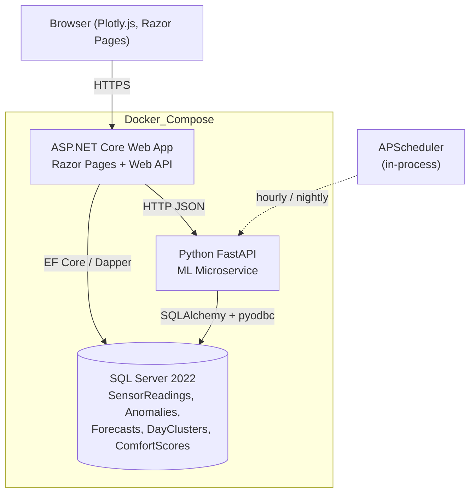
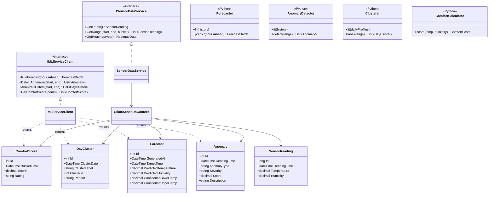
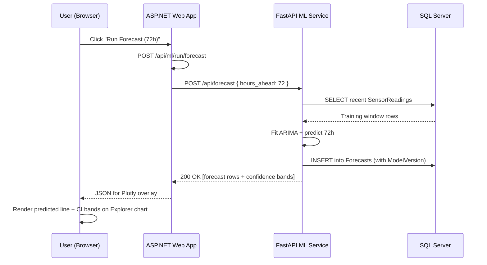
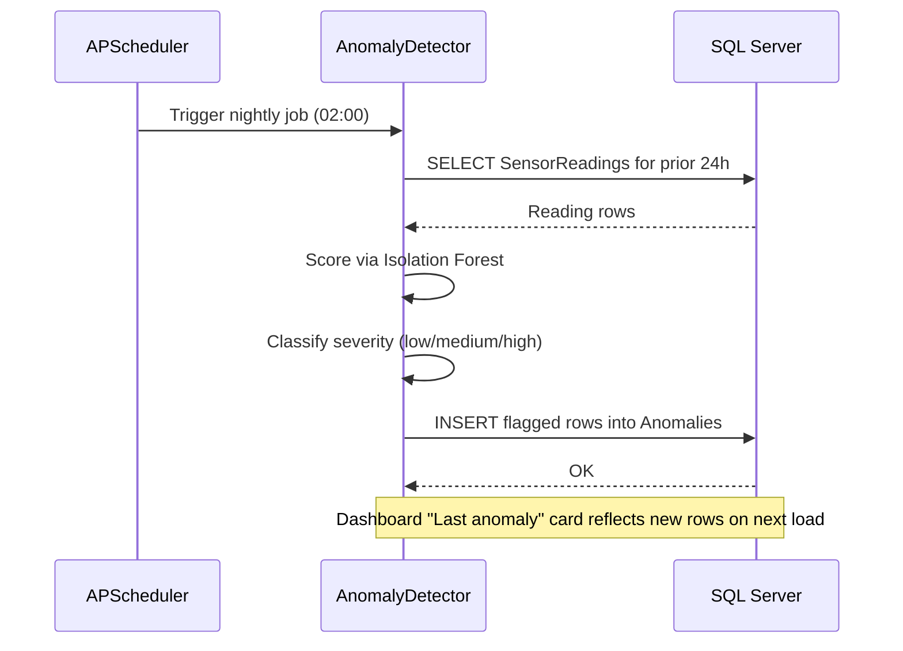
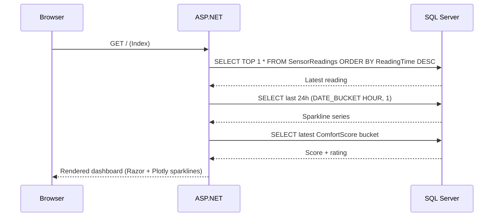

# ClimaSense

> Indoor climate monitoring, analytics, and predictive intelligence — from raw sensor data to actionable insight.


---

## 📓 Detailed Analysis

> **A fully-executed Jupyter notebook accompanies this spec — 108 cells, 26 figures, end-to-end reproducible from the raw CSV.**
>
> **➡ [`Climate_Time_Series_Analysis.ipynb`](./Climate_Time_Series_Analysis.ipynb)**
>
> The notebook walks the entire pipeline: dedup + resample, exploratory analysis, time-series structural diagnostics (ADF/KPSS, ACF/PACF, decomposition, Welch periodogram), classical forecasting (ARIMA, SARIMA, Holt-Winters, baselines), and **PyTorch sequence modelling** (LSTM, 1D-CNN) on ten years of one-minute indoor sensor readings. Skip ahead to the [results section below](#analysis-notebook--climate_time_series_analysisipynb) for leaderboards and headline plots.

---

## Overview

ClimaSense is an end-to-end indoor climate intelligence platform built around six-plus years of real indoor temperature and humidity readings captured at five-minute intervals. It pairs an **ASP.NET Core** web application with a **Python FastAPI** machine learning microservice and **SQL Server 2022** time-series storage to turn raw sensor streams into forecasts, anomalies, behavioural clusters, and comfort scoring.

The project targets freelance reviewers, engineering leaders, and decision-makers at startups, SMBs, enterprises, and agencies. It demonstrates full-stack ownership across data ingestion, time-series SQL, REST-based polyglot architecture, machine learning, and dark-themed Plotly.js dashboards — all runnable with a single `docker compose up`.

---

## Key Features

### Live Dashboard
| Feature | Description |
| --- | --- |
| Current reading | Large-display temperature and humidity with timestamp |
| 24-hour sparklines | At-a-glance trend lines for both metrics |
| Comfort zone indicators | Color-coded "too hot / ideal / too cold" bands |
| Comfort score card | 0–100 ASHRAE-based rating with qualitative label |
| Last anomaly | Most recent ML-flagged anomaly from the prior 24 hours |

### Historical Explorer
| Feature | Description |
| --- | --- |
| Interactive charts | Zoom, pan, hover, and crosshair via Plotly.js |
| Range selector | 1D / 1W / 1M / 3M / 1Y / ALL buttons plus custom picker |
| Aggregation toggle | Raw 5-minute readings, hourly, daily, or weekly buckets |
| Min/Max bands | Overlayed envelope on aggregated series |
| Heatmap calendar | GitHub-contribution-style daily temperature intensity view |

### AI / ML Analysis
| Feature | Technique | Outcome |
| --- | --- | --- |
| Forecasting | ARIMA | 24–72 hour predictions with confidence bands |
| Anomaly detection | Isolation Forest | Severity-scored markers with drill-down details |
| Pattern clustering | K-Means | Labeled daily profiles (e.g. "warm weekday", "cool weekend") |
| Comfort scoring | ASHRAE heuristic | Hourly 0–100 comfort index trended over time |

### Alerts and Recommendations
| Feature | Description |
| --- | --- |
| Threshold rules | "Alert if temperature > X for Y minutes" configuration UI |
| Alert history | Persisted log of prior threshold breaches |
| Recommendations engine | Simulated HVAC optimization tips driven by historical clusters |
| Cost narrative | Estimated energy/risk savings framed for decision-makers |

---

## Tech Stack

| Category | Technology | Purpose |
| --- | --- | --- |
| Web framework | ASP.NET Core Razor Pages | Server-rendered pages with embedded charts |
| HTTP API | ASP.NET Core Web API | REST endpoints for sensor and ML data |
| Data access | Entity Framework Core / Dapper | Repository layer against SQL Server |
| Visualisation | Plotly.js (dark theme) | Interactive time-series, heatmap, and forecast charts |
| Database | SQL Server 2022 | Time-series storage with `DATE_BUCKET`, `GENERATE_SERIES`, `IGNORE NULLS` |
| ML runtime | Python 3 + FastAPI + Uvicorn | HTTP microservice for model training and inference |
| ML libraries | scikit-learn, statsmodels | Isolation Forest, K-Means, ARIMA |
| Data tooling | pandas, numpy, SQLAlchemy, pyodbc | Data shaping and DB I/O inside the ML service |
| Scheduling | APScheduler | Hourly forecast refresh, nightly clustering and anomaly sweeps |
| Orchestration | Docker Compose | One-command boot of DB, web, and ML containers |
| Interop | REST over HTTP (JSON) | Contracts between .NET and Python services |

---

## Architecture

ClimaSense follows a **three-tier, polyglot, containerised** design. The ASP.NET Core web tier serves pages and proxies ML calls. The Python FastAPI tier owns model training, inference, and persistence of derived results. SQL Server is the single source of truth for both raw readings and ML-derived tables, with indexed time-series access patterns.

Both services connect to the database directly — the .NET side reads sensor data and ML results for rendering, while the Python side reads raw readings and writes forecasts, anomalies, clusters, and comfort scores. Synchronous REST is used only for on-demand "Run Analysis" flows; scheduled jobs inside the Python container operate autonomously via APScheduler.



**Interaction modes**

- **Read path (dashboard / explorer):** Browser hits Razor Pages, which call the ASP.NET Web API, which queries SQL Server using time-bucketed SQL and streams JSON back to Plotly.js.
- **ML on-demand path:** Browser triggers `POST /api/ml/run/{type}` on the .NET side, which proxies to the FastAPI endpoint, which trains/infers, persists, and returns results.
- **ML scheduled path:** APScheduler inside the FastAPI container runs forecasts hourly and clustering/anomaly detection nightly, writing straight to SQL Server.

---

## Code Structure

### Planned directory layout

```
ClimaSense/
├── docker-compose.yml
├── README.md
├── src/
│   ├── ClimaSense.Web/                # ASP.NET Core Razor Pages + Web API
│   │   ├── Program.cs
│   │   ├── appsettings.json
│   │   ├── Controllers/               # Readings, Anomalies, Forecasts, Clusters, Comfort
│   │   ├── Services/                  # SensorDataService, MLServiceClient
│   │   ├── Repositories/              # Per-entity repositories over EF/Dapper
│   │   ├── Models/                    # SensorReading, Anomaly, Forecast, DayCluster, ComfortScore
│   │   ├── Data/
│   │   │   └── ClimaSenseDbContext.cs
│   │   ├── Pages/                     # Index (Dashboard), Explorer, Analysis, Alerts
│   │   └── wwwroot/
│   │       ├── css/site.css
│   │       └── js/                    # dashboard.js, explorer.js, analysis.js, plotly-config.js
│   │
│   └── ClimaSense.ML/                 # Python FastAPI ML service
│       ├── main.py                    # FastAPI app + endpoints
│       ├── config.py                  # Settings, DB URL
│       ├── database.py                # SQLAlchemy engine + session
│       ├── models/
│       │   ├── forecaster.py          # ARIMA
│       │   ├── anomaly_detector.py    # Isolation Forest
│       │   ├── clusterer.py           # K-Means on daily profiles
│       │   └── comfort.py             # ASHRAE comfort index
│       ├── schemas/                   # Pydantic request/response models
│       ├── services/
│       │   ├── data_service.py        # Reads from SensorReadings
│       │   └── persistence_service.py # Writes ML results
│       └── scheduler.py               # APScheduler jobs
│
├── data/
│   └── sensor_readings.csv            # ~630K rows per metric, 2019→present
│
└── scripts/
    ├── init-db.sql                    # Schema + indexes
    └── import-data.sql                # Bulk CSV import
```

### Class / module diagram



---

## Sequence Diagrams

### On-demand "Run Forecast" from the UI



### Scheduled nightly anomaly detection



### Dashboard load — latest reading and comfort score



---

## Data and Storage Notes

- **Dataset:** ~10 years of real indoor readings (2016-01-20 → 2026-05-07) at roughly one-minute cadence, ~3.07 M raw rows in CSV form. After deduplicating identical timestamps the working dataset is **2.45 M rows**, which resamples to **90,239 hourly slots** and **3,761 daily slots**.
- **Raw table:** `SensorReadings` clustered on `ReadingTime` for sequential time-series scans; covering non-clustered indexes on `Temperature` and `Humidity`.
- **Derived tables:** `Anomalies`, `Forecasts`, `DayClusters`, `ComfortScores` — each indexed on its relevant time column.
- **Time-series SQL:** `DATE_BUCKET` for hourly/daily/weekly aggregation; `GENERATE_SERIES` plus `LAST_VALUE(... ) IGNORE NULLS` for gap filling across missing intervals.

---

## Analysis Notebook — `Climate_Time_Series_Analysis.ipynb`

A self-contained, fully-executed Jupyter notebook accompanies the platform spec: **108 cells (60 markdown / 48 code)** that walk from raw CSV all the way through forecasting and sequence modelling, with every plot reproducible end-to-end.

- 📓 Notebook source: [`Climate_Time_Series_Analysis.ipynb`](./Climate_Time_Series_Analysis.ipynb) — GitHub renders all 26 figures inline.

The notebook is organised into four movements:

| § | Section | What's inside |
| --- | --- | --- |
| 5 | Exploratory Data Analysis | dtypes, summary stats, missing-data audit, distributions, joint T↔RH, hour×day-of-week heatmaps, monthly seasonality, yearly trend, IQR outlier check |
| 6 | Time Series Analysis | rolling stats, ADF + KPSS stationarity tests, differencing, ACF/PACF, additive decomposition × 2 (24 h, 7 d), STL, Welch periodogram, T↔RH cross-correlation |
| 7 | Classical Forecasting | 3 baselines, Holt-Winters, ARIMA(2,0,2), SARIMA(1,0,1)(1,0,1,24), 24 h vs 72 h horizons, residual diagnostics |
| 8 | Sequence Modelling | lag + cyclical-calendar features, lag-LR, HistGradientBoosting (1-step + recursive), **PyTorch LSTM**, **1D-CNN**, hidden-state PCA visualisation |

### Headline plots

#### Coverage and rhythms


The full ten-year hourly view shows a tightly controlled environment — temperature drifts in a narrow ~5 °C band, humidity in a wider ~30 % band — with a few clearly visible regime shifts (sensor relocations / HVAC changes).

 

The heatmap surfaces a faint but real diurnal pattern; the joint distribution shows the expected negative T↔RH correlation but with broad scatter — the sensor sees a multi-modal "indoor weather" rather than a single steady state.

 

Monthly boxplots reveal a 1-2 °C swing between spring and autumn; the yearly mean is nearly flat — there is no strong long-term drift in this room.

#### Time-series structure


ACF decays slowly with a clear bump at lag 24 h; PACF cuts off after ~2 lags. Together these point at low-order ARMA terms with a daily seasonal component.

 

Both the additive decomposition and the more robust STL agree: small daily seasonality (~0.5 °C peak-to-peak) sitting on a near-flat trend with most of the variance going to residuals — consistent with a controlled indoor environment.


The periodogram confirms the dominant cycle at 1 cycle/day with a much weaker harmonic near 12 h.

### Stationarity tests

```
--- Hourly temperature (n = 90,239) ---
  ADF   stat = -9.517   p = 3.13e-16   →  stationary
  KPSS  stat =  4.473   p = 0.01       →  non-stationary

--- Hourly humidity   (n = 90,239) ---
  ADF   stat = -4.980   p = 2.43e-05   →  stationary
  KPSS  stat =  4.890   p = 0.01       →  non-stationary
```

The ADF/KPSS pair disagrees — a textbook *trend-stationary* signature. The series is mean-reverting around a slowly-moving level, which is exactly the regime where lag-feature linear models tend to thrive.

### Classical forecasting — 14-day held-out test

Last 14 days (336 hours) held out; train = 89,903 hours.

| Model | MAE (°C) | RMSE (°C) | MAPE | sMAPE |
| --- | ---: | ---: | ---: | ---: |
| **Rolling 24h mean** | 0.248 | **0.320** | 1.314 | 1.313 |
| Holt-Winters (additive, *m* = 24) | 0.247 | 0.346 | 1.314 | 1.310 |
| Naive (last value) | **0.217** | 0.370 | **1.164** | **1.153** |
| Seasonal naive (lag-24h) | 0.307 | 0.433 | 1.627 | 1.626 |
| SARIMA(1,0,1)(1,0,1,24) | 0.344 | 0.442 | 1.836 | 1.814 |
| ARIMA(2,0,2) | 0.571 | 0.649 | 3.005 | 3.063 |


Headline finding: the simplest baselines (rolling 24h mean, naive, Holt-Winters) **beat** the heavier ARIMA/SARIMA fits on this signal, because indoor temperature has very low variance (σ ≈ 1.6 °C) and almost no genuine short-term predictability beyond persistence. This is exactly the kind of result that a lazy "ARIMA wins" narrative would obscure.

 

The multi-horizon plot shows SARIMA's confidence band widening realistically — the model is honest about its growing uncertainty, even if its point forecast is not the best on the leaderboard.


### Sequence modelling — same test horizon, expanded model family

| Model | MAE (°C) | RMSE (°C) |
| --- | ---: | ---: |
| **Linear regression on lag features** | **0.214** | **0.293** |
| Gradient boosting (1-step) | 0.215 | 0.305 |
| LSTM (PyTorch) | 0.248 | 0.314 |
| 1D-CNN (PyTorch) | 0.266 | 0.340 |
| Gradient boosting (recursive) | 0.522 | 0.596 |


A plain **linear regression on 8 lag terms + cyclical hour/dow encodings** (`sin`/`cos`) ties or beats every neural model on this signal. The LSTM and 1D-CNN are perfectly competent — they just don't have anything extra to learn once persistence and seasonality are encoded as features. The recursive gradient booster collapses because of error compounding over 336 steps.

  


Projecting the LSTM's last hidden state per day into 2-D with PCA shows weekday/weekend overlap — there is no obvious "warm weekday vs cool weekend" cluster, mirroring what the EDA already hinted at.

### Forecasting takeaways

- For this signal, the right deployment is the **simplest model that captures persistence + a daily cycle** — the lag-LR or rolling baseline, both retrainable in seconds.
- The notebook's value is mainly **methodological**: it documents *why* a heavier model isn't justified here, with reproducible evidence at each step.
- Material gains will require **exogenous regressors** — outdoor weather, occupancy, HVAC mode — which the README's Status / Roadmap section already calls out.

---

## REST API Surface (planned)

### ASP.NET Core
```
GET  /api/readings/latest
GET  /api/readings/range?start&end&bucket=hour|day|week
GET  /api/readings/heatmap?year=2024
GET  /api/anomalies?start&end
GET  /api/forecasts/latest
GET  /api/clusters?start&end
GET  /api/comfort/current
POST /api/ml/run/{forecast|anomalies|clusters|comfort}
```

### FastAPI
```
POST /api/forecast              { hours_ahead }
POST /api/anomalies/detect      { start_date, end_date }
POST /api/clusters/analyze      { start_date, end_date }
GET  /api/comfort/score?hours=24
GET  /api/health
```

---

## Status and Roadmap

**Current status:** Analysis notebook is complete and reproducible end-to-end (`Climate_Time_Series_Analysis.ipynb` + rendered HTML, 26 figures, 4 model leaderboards). Platform implementation (.NET web tier, FastAPI ML service, SQL Server, Docker Compose) is still in the specification stage.

| Phase | Focus | Deliverables |
| --- | --- | --- |
| ✅ Done | Time-series notebook | EDA + TSA + classical + sequence modelling, executed end-to-end, asset library |
| Days 1–2 | Foundation | `docker-compose.yml`, `init-db.sql`, `import-data.sql`, verified time-series queries |
| Days 3–4 | ASP.NET Core API | EF Core / Dapper wiring, readings endpoints, Swagger, gap-filling range endpoint |
| Days 5–7 | Dashboard UI | Dark theme, Dashboard, Explorer, heatmap calendar, shared Plotly config |
| Days 8–10 | ML service | FastAPI scaffold, ARIMA, Isolation Forest, K-Means, ASHRAE comfort, APScheduler |
| Days 11–12 | ML into UI | Forecast overlay, anomaly markers, cluster view, comfort trend, "Run Analysis" |
| Days 13–14 | Polish | Alerts page, recommendation cards, responsive tweaks, final README + demo walkthrough |

---

## Portfolio Talking Points

- Real data — 6+ years of actual 5-minute indoor sensor readings, not synthetic.
- Polyglot architecture — .NET and Python cooperating via clean REST contracts.
- SQL Server 2022 time-series features — `DATE_BUCKET`, `GENERATE_SERIES`, `IGNORE NULLS` gap filling.
- Three distinct ML techniques — ARIMA forecasting, Isolation Forest anomaly detection, K-Means pattern clustering — plus an ASHRAE-based comfort index.
- One-command stack — `docker compose up` boots database, web app, and ML service with healthchecks.
- End-to-end ownership — schema design, ingestion, API, UI, ML pipelines, scheduling, and DevOps.

---

## License

Released under the [MIT License](./LICENSE).
