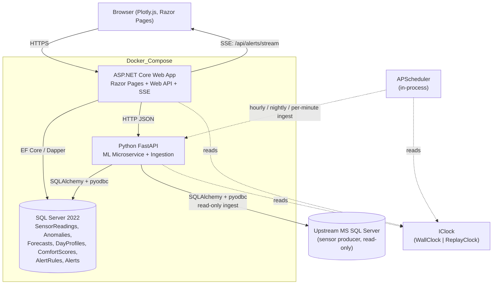
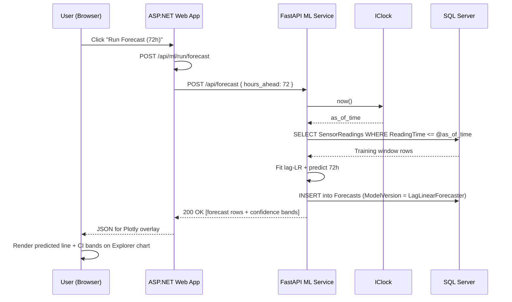
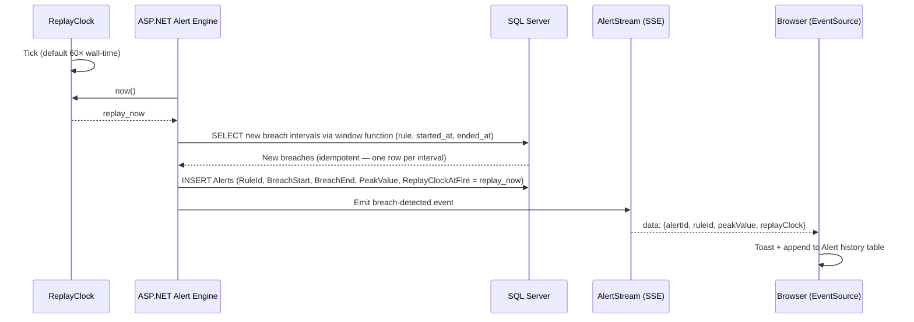
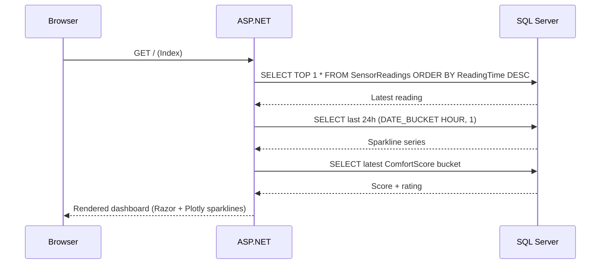

# ClimaSense

> Indoor climate monitoring, analytics, and predictive intelligence — from raw sensor data to actionable insight.


> ⚠️ **Work in progress.** The analysis notebook is complete; the platform is being built one slice at a time (see [issue #2](https://github.com/arthurkahwa/climasense/issues/2)). **Slices 1–3 have landed:**
>
> * Slice 1 — `docker-compose.yml` boots SQL Server 2022 + FastAPI ML + .NET web; structured JSON logs with `X-Request-ID` correlation; `AlertStream` SSE singleton heartbeating to a Razor page; `CursorSnapshot` and `IClock` wired in both tiers.
> * Slice 2 — `contracts/openapi.yaml` is the wire-format source of truth; Kiota generates the .NET client and `datamodel-codegen` generates the Pydantic models; FastAPI's `ContractValidator` fails the process on any drift; five `/api/ml/*` proxy endpoints exercise the failure-mapping pipeline (503 / 502 / 504 with `ProblemDetails`).
> * Slice 3 — `IngestionService` bootstraps `SensorReadings` from the bundled `sensor_data.csv` via `bcp` on first boot (~35 s for 2.45 M deduped rows); idempotent on subsequent boots. `GET /api/readings/latest` and a dashboard "Latest reading" card go live (read path bypasses the ml tier per ADR-0010).
>
> APIs, code paths, and feature work in slices 4+ below are planned, not yet implemented. Expect breaking changes.

---

## 📓 Detailed Analysis

> **A fully-executed Jupyter notebook accompanies this spec — 108 cells, 26 figures, end-to-end reproducible from the raw CSV.**
>
> **➡ [`Climate_Time_Series_Analysis.ipynb`](./Climate_Time_Series_Analysis.ipynb)**
>
> The notebook walks the entire pipeline: dedup + resample, exploratory analysis, time-series structural diagnostics (ADF/KPSS, ACF/PACF, decomposition, Welch periodogram), classical forecasting (ARIMA, SARIMA, Holt-Winters, baselines), and **PyTorch sequence modelling** (LSTM, 1D-CNN) on ten years of one-minute indoor sensor readings. Skip ahead to the [results section below](#analysis-notebook--climate_time_series_analysisipynb) for leaderboards and headline plots.

---

## Overview

ClimaSense is an end-to-end indoor climate intelligence platform built around six-plus years of real indoor temperature and humidity readings captured at five-minute intervals. It pairs an **ASP.NET Core** web application with a **Python FastAPI** machine learning microservice and **SQL Server 2022** time-series storage to turn raw sensor streams into evidence-driven forecasts, type-aware anomaly classification, calendar-conditioned daily profiles, and ASHRAE 55 comfort scoring.

The project targets freelance reviewers, engineering leaders, and decision-makers at startups, SMBs, enterprises, and agencies. It demonstrates full-stack ownership across data ingestion, time-series SQL, REST-based polyglot architecture, evidence-driven analytics with notebook receipts, and dark-themed Plotly.js dashboards — all runnable with a single `docker compose up`.

---

## Key Features

### Live Dashboard
| Feature | Description |
| --- | --- |
| Current reading | Large-display temperature and humidity with timestamp |
| 24-hour sparklines | At-a-glance trend lines for both metrics |
| Comfort zone indicators | Color-coded "too hot / ideal / too cold" bands |
| Comfort score card | 0–100 ASHRAE-based rating with qualitative label |
| Last anomaly | Most recent typed anomaly (sensor failure, regime shift, or residual outlier) from the prior 24 hours |

### Historical Explorer
| Feature | Description |
| --- | --- |
| Interactive charts | Zoom, pan, hover, and crosshair via Plotly.js |
| Range selector | 1D / 1W / 1M / 3M / 1Y / ALL buttons plus custom picker |
| Aggregation toggle | Raw 5-minute readings, hourly, daily, or weekly buckets |
| Min/Max bands | Overlayed envelope on aggregated series |
| Heatmap calendar | GitHub-contribution-style daily temperature intensity view |

### Models and Analytics
| Feature | Technique | Outcome |
| --- | --- | --- |
| Forecasting | Lag-LR (linear regression on 8 lags + sin/cos hour/dow) behind `IForecaster` | 24–72 hour predictions with notebook-seeded leaderboard alongside the live model |
| Anomaly detection | Three-detector pipeline — SQL rules + PELT changepoint (`ruptures`) + lag-LR residual outliers | Type-aware markers (`sensor_failure` / `regime_shift` / `residual_outlier`) with severity meaningful within each type |
| Pattern profiles | Calendar-conditioned z-scores over `(day_of_week, hour_of_day)` cohorts | Deterministic daily profile labels (`quiet` / `warm` / `cool` / `volatile`) from a SQL CASE expression |
| Comfort scoring | ASHRAE 55-2020 graphical comfort zone (Figure 5.3.1, summer + winter polygons) | Hourly 0–100 comfort index with rating bands trended over time |

### Alerts and Comfort Budget
| Feature | Description |
| --- | --- |
| Threshold rules | "Alert if temperature > X for Y minutes" configuration UI |
| Alert history | Persisted breach intervals keyed by replay-clock time, delivered to open dashboards via SSE (`/api/alerts/stream`) |
| Comfort Budget | Three deterministic SQL aggregations — hours outside zone (last 7 days), worst calendar cell from `DayProfiles`, and 7-day comfort trend sparkline |

---

## Tech Stack

| Category | Technology | Purpose |
| --- | --- | --- |
| Web framework | ASP.NET Core Razor Pages | Server-rendered pages with embedded charts |
| HTTP API | ASP.NET Core Web API | REST endpoints for sensor and ML data |
| Data access | Entity Framework Core / Dapper | Repository layer against SQL Server |
| Visualisation | Plotly.js (dark theme) | Interactive time-series, heatmap, and forecast charts |
| Data source | Upstream MS SQL Server (read-only) | Production sensor readings, mirrored into ClimaSense by an ingestion job (SQLAlchemy + pyodbc) |
| Database | SQL Server 2022 | ClimaSense's own time-series storage with `DATE_BUCKET`, `GENERATE_SERIES`, `IGNORE NULLS` |
| ML runtime | Python 3 + FastAPI + Uvicorn | HTTP microservice for model training and inference |
| ML libraries | scikit-learn (lag-LR), statsmodels (notebook only), ruptures (PELT changepoint detection) | Production forecaster, notebook leaderboard, regime-shift detector |
| Data tooling | pandas, numpy, SQLAlchemy, pyodbc | Data shaping and DB I/O inside the ML service |
| Scheduling | APScheduler | Hourly forecast refresh, nightly anomaly sweeps and profile recomputation |
| Alert delivery | Server-Sent Events (`EventSource` / ASP.NET SSE) | Browser-only live notification of new breach intervals |
| Orchestration | Docker Compose | One-command boot of DB, web, and ML containers |
| Interop | REST over HTTP (JSON) | Contracts between .NET and Python services |

---

## Architecture

ClimaSense follows a **three-tier, polyglot, containerised** design. The ASP.NET Core web tier serves pages, proxies ML calls, and pushes alert events over SSE. The Python FastAPI tier owns model training, inference, ingestion, and persistence of derived results. Raw sensor readings live in an upstream MS SQL Server owned by the data producer; ClimaSense's own SQL Server 2022 instance mirrors them via a scheduled ingestion job and stores all derived tables, with indexed time-series access patterns. Every layer that needs the current time goes through an `IClock` abstraction so demos can run deterministically against historical data without touching `DateTime.UtcNow`.

Both services connect to the database directly — the .NET side reads sensor data and derived results for rendering, while the Python side reads raw readings and writes forecasts, anomalies, profiles, and comfort scores. Synchronous REST is used only for on-demand "Run Analysis" flows; scheduled jobs inside the Python container operate autonomously via APScheduler against the active clock.



**Interaction modes**

- **Read path (dashboard / explorer):** Browser hits Razor Pages, which call the ASP.NET Web API, which queries SQL Server using time-bucketed SQL and streams JSON back to Plotly.js.
- **ML on-demand path:** Browser triggers `POST /api/ml/run/{type}` on the .NET side, which proxies to the FastAPI endpoint, which trains/infers, persists, and returns results.
- **Ingestion path:** APScheduler runs an ingestion job every minute that pulls new rows (`ReadingTime > MAX(ReadingTime)`) from the upstream MS SQL Server into ClimaSense's `SensorReadings` table. Initial load is an idempotent full mirror keyed on `(ReadingTime)`. Read-only credentials; no writes to upstream.
- **ML scheduled path:** APScheduler inside the FastAPI container runs forecasts hourly and anomaly detection / profile refresh nightly against `IClock.Now()`, writing straight to SQL Server.
- **Alert delivery path:** ASP.NET evaluates threshold rules each tick, persists new breach intervals as `Alerts` rows, and pushes `breach-detected` events to open dashboards over `/api/alerts/stream` (SSE). Browser-only delivery; integration with email / SMS / push is intentionally out of scope.

### Replay Clock

ClimaSense ships in **Replay mode**: a virtual cursor advances through the mirrored history in ClimaSense's own SQL Server at a configurable speed (default 60×). Every "now" call in both the .NET and Python services routes through `IClock` — APScheduler triggers, EF Core default-value generators, latest-reading queries, threshold-alert evaluation, and SSE timestamps all consult the active clock. SQL queries use parameterised `@as_of_time` rather than `GETUTCDATE()`. A demo controls panel exposes pause / resume / seek and the speed multiplier; switching to `WallClock` for a future live deployment requires no code changes outside the clock binding.

---

## Scope

> **Scope:** ClimaSense is a single-zone analytical tool driven by one sensor's history. Multi-sensor / multi-zone support is intentionally out of scope; the schema and queries assume one logical environment.

The schema is free of `LocationId` / `SensorId` / `ZoneId` columns. Future multi-zone support is a textbook migration — `ALTER TABLE ADD COLUMN LocationId INT NOT NULL DEFAULT 1`, FK + index, parameter threaded through queries — deferred until needed.

---

## Code Structure

### Planned directory layout

```
ClimaSense/
├── docker-compose.yml
├── README.md
├── src/
│   ├── ClimaSense.Web/                # ASP.NET Core Razor Pages + Web API
│   │   ├── Program.cs
│   │   ├── appsettings.json
│   │   ├── Controllers/               # Readings, Anomalies, Forecasts, Profiles, Comfort, Alerts, Clock
│   │   ├── Services/
│   │   │   ├── SensorDataService.cs
│   │   │   ├── MLServiceClient.cs
│   │   │   ├── Clock/
│   │   │   │   ├── IClock.cs          # DateTime Now() abstraction
│   │   │   │   ├── WallClock.cs       # Production-default future
│   │   │   │   └── ReplayClock.cs     # Virtual cursor (default 60×)
│   │   │   └── Sse/
│   │   │       └── AlertStream.cs     # SSE endpoint for breach-detected events
│   │   ├── Repositories/              # Per-entity repositories over EF/Dapper
│   │   ├── Models/                    # SensorReading, Anomaly, Forecast, DayProfile, ComfortScore, AlertRule, Alert
│   │   ├── Data/
│   │   │   └── ClimaSenseDbContext.cs
│   │   ├── Pages/                     # Index (Dashboard), Explorer, Analysis, Alerts, Comfort Budget
│   │   └── wwwroot/
│   │       ├── css/site.css
│   │       └── js/                    # dashboard.js, explorer.js, analysis.js, alerts-sse.js, plotly-config.js
│   │
│   └── ClimaSense.ML/                 # Python FastAPI ML service
│       ├── main.py                    # FastAPI app + endpoints
│       ├── config.py                  # Settings, DB URL
│       ├── database.py                # SQLAlchemy engine + session
│       ├── clock.py                   # IClock protocol, WallClock, ReplayClock
│       ├── replay.py                  # Virtual cursor advancement against the CSV
│       ├── models/
│       │   ├── forecaster.py          # IForecaster + LagLinearForecaster (production) + 4 stubs
│       │   ├── anomaly_strategies.py  # IAnomalyStrategy + 3 strategies: SensorFailureRules, ChangepointDetector, ResidualOutlierDetector
│       │   └── comfort.py             # ASHRAE 55 graphical comfort zone (summer + winter polygons)
│       ├── schemas/                   # Pydantic request/response models
│       ├── services/
│       │   ├── data_service.py        # Reads from SensorReadings
│       │   ├── ingestion_service.py   # Pulls from upstream MS SQL Server → SensorReadings (read-only)
│       │   ├── profiles_service.py    # SQL-driven calendar-conditioned z-scores → DayProfiles
│       │   └── persistence_service.py # Writes derived results
│       └── scheduler.py               # APScheduler jobs (consult IClock)
│
├── data/
│   └── sensor_readings.csv            # Notebook fixture only — platform reads from upstream SQL Server
│
└── scripts/
    └── init-db.sql                    # Schema + indexes
```

### Class / module diagram

```mermaid
classDiagram
    class SensorReading {
        +long Id
        +DateTime ReadingTime
        +decimal Temperature
        +decimal Humidity
    }

    class Anomaly {
        +int Id
        +DateTime ReadingTime
        +AnomalyType AnomalyType
        +string Severity
        +decimal Score
        +string Description
    }

    class AnomalyType {
        <<enum>>
        sensor_failure
        regime_shift
        residual_outlier
    }

    class Forecast {
        +int Id
        +DateTime GeneratedAt
        +DateTime TargetTime
        +decimal PredictedTemperature
        +decimal PredictedHumidity
        +decimal ConfidenceLowerTemp
        +decimal ConfidenceUpperTemp
    }

    class DayProfile {
        +int Id
        +DateTime Date
        +int DayOfWeek
        +decimal MeanResidual
        +decimal MaxAbsZscore
        +string Pattern
    }

    class ComfortScore {
        +int Id
        +DateTime BucketTime
        +decimal Score
        +string Rating
    }

    class AlertRule {
        +int RuleId
        +string Metric
        +string Operator
        +decimal Threshold
        +int DurationMinutes
        +bool Enabled
        +DateTime CreatedAt
    }

    class Alert {
        +int AlertId
        +int RuleId
        +DateTime BreachStart
        +DateTime BreachEnd
        +decimal PeakValue
        +DateTime ReplayClockAtFire
    }

    class ISensorDataService {
        <<interface>>
        +GetLatest() SensorReading
        +GetRange(start, end, bucket) List~SensorReading~
        +GetHeatmap(year) HeatmapData
    }

    class IMLServiceClient {
        <<interface>>
        +RunForecast(hoursAhead) ForecastBatch
        +DetectAnomalies(start, end) List~Anomaly~
        +AnalyzeProfiles(start, end) List~DayProfile~
        +GetComfortScore(hours) List~ComfortScore~
    }

    class IClock {
        <<interface>>
        +Now() DateTime
    }
    class WallClock
    class ReplayClock {
        +Pause()
        +Resume()
        +Seek(target)
        +SetSpeed(multiplier)
    }

    class SensorDataService
    class MLServiceClient
    class ClimaSenseDbContext
    class AlertStream {
        +Subscribe() EventStream
        +Emit(BreachEvent)
    }

    ISensorDataService <|.. SensorDataService
    IMLServiceClient <|.. MLServiceClient
    IClock <|.. WallClock
    IClock <|.. ReplayClock
    SensorDataService --> ClimaSenseDbContext
    SensorDataService ..> IClock
    AlertStream ..> IClock
    MLServiceClient ..> Forecast : returns
    MLServiceClient ..> Anomaly : returns
    MLServiceClient ..> DayProfile : returns
    MLServiceClient ..> ComfortScore : returns
    Anomaly --> AnomalyType
    Alert --> AlertRule
    ClimaSenseDbContext --> SensorReading
    ClimaSenseDbContext --> Anomaly
    ClimaSenseDbContext --> Forecast
    ClimaSenseDbContext --> DayProfile
    ClimaSenseDbContext --> ComfortScore
    ClimaSenseDbContext --> AlertRule
    ClimaSenseDbContext --> Alert

    class IForecaster {
        <<Python interface>>
        +fit(history)
        +predict(horizonHours) ForecastBatch
    }
    class LagLinearForecaster {
        <<Python — production>>
        +fit(history)
        +predict(horizonHours) ForecastBatch
    }
    class ArimaForecaster {
        <<Python — stub>>
    }
    class SarimaForecaster {
        <<Python — stub>>
    }
    class LstmForecaster {
        <<Python — stub>>
    }
    class RollingMeanForecaster {
        <<Python — stub>>
    }

    IForecaster <|.. LagLinearForecaster
    IForecaster <|.. ArimaForecaster
    IForecaster <|.. SarimaForecaster
    IForecaster <|.. LstmForecaster
    IForecaster <|.. RollingMeanForecaster

    class IAnomalyStrategy {
        <<Python interface>>
        +detect(range) List~Anomaly~
    }
    class SensorFailureRules {
        <<Python — SQL window functions>>
    }
    class ChangepointDetector {
        <<Python — PELT via ruptures>>
    }
    class ResidualOutlierDetector {
        <<Python — reuses LagLinearForecaster>>
    }

    IAnomalyStrategy <|.. SensorFailureRules
    IAnomalyStrategy <|.. ChangepointDetector
    IAnomalyStrategy <|.. ResidualOutlierDetector

    class ComfortCalculator {
        <<Python — ASHRAE 55 graphical zone>>
        +score(temp, humidity, season) ComfortScore
    }
```



---

## Sequence Diagrams

### On-demand "Run Forecast" from the UI



### Scheduled nightly anomaly detection (three-detector pipeline)

```mermaid
sequenceDiagram
    participant S as APScheduler
    participant C as IClock
    participant R as SensorFailureRules
    participant CP as ChangepointDetector
    participant RO as ResidualOutlierDetector
    participant F as LagLinearForecaster
    participant D as SQL Server

    S->>C: now()
    C-->>S: as_of_time
    S->>R: detect(prior 24h)
    R->>D: SELECT readings, apply window functions (gaps, stuck values, range)
    D-->>R: Failure rows
    R->>D: INSERT Anomalies (AnomalyType = sensor_failure)

    S->>CP: detect(prior 24h)
    CP->>D: SELECT daily means
    D-->>CP: Daily series
    CP->>CP: PELT changepoint search (ruptures)
    CP->>D: INSERT Anomalies (AnomalyType = regime_shift)

    S->>RO: detect(prior 24h)
    RO->>F: predict over prior 24h
    F-->>RO: ŷ_t series
    RO->>RO: severity = |y_t − ŷ_t| / rolling_σ
    RO->>D: INSERT Anomalies (AnomalyType = residual_outlier)

    Note over S,D: Each detector writes its own typed rows; the Last anomaly card on the dashboard reflects new rows on next load
```

### Replay-cursor advance and threshold alert delivery



### Dashboard load — latest reading and comfort score



---

## Data and Storage Notes

- **Dataset:** ~10 years of real indoor readings (2016-01-20 → 2026-05-07) at roughly one-minute cadence, ~3.07 M raw rows. The platform pulls from an **upstream MS SQL Server** (read-only) into ClimaSense's own `SensorReadings` table via a per-minute ingestion job; the bundled `sensor_data.csv` is retained solely as a reproducible fixture for the notebook. After deduplicating identical timestamps the working dataset is **2.45 M rows**, which resamples to **90,239 hourly slots** and **3,761 daily slots**.
- **Raw table:** `SensorReadings` clustered on `ReadingTime` for sequential time-series scans; covering non-clustered indexes on `Temperature` and `Humidity`.
- **Derived tables:** `Anomalies` (typed: `sensor_failure | regime_shift | residual_outlier`), `Forecasts` (with `ModelVersion`), `DayProfiles` (calendar-conditioned z-scores; `Pattern ∈ {quiet, warm, cool, volatile}`), `ComfortScores`, `AlertRules`, and `Alerts` (each row carries `ReplayClockAtFire` for explicit clock provenance) — each indexed on its relevant time column.
- **Time-series SQL:** `DATE_BUCKET` for hourly/daily/weekly aggregation; `GENERATE_SERIES` plus `LAST_VALUE(... ) IGNORE NULLS` for gap filling across missing intervals. `DayProfiles` recomputation is a SQL-only refresh, not a scheduled model fit.

---

## Analysis Notebook — `Climate_Time_Series_Analysis.ipynb`

A self-contained, fully-executed Jupyter notebook accompanies the platform spec: **108 cells (60 markdown / 48 code)** that walk from raw CSV all the way through forecasting and sequence modelling, with every plot reproducible end-to-end.

- 📓 Notebook source: [`Climate_Time_Series_Analysis.ipynb`](./Climate_Time_Series_Analysis.ipynb) — GitHub renders all 26 figures inline.

The notebook is organised into four movements:

| § | Section | What's inside |
| --- | --- | --- |
| 5 | Exploratory Data Analysis | dtypes, summary stats, missing-data audit, distributions, joint T↔RH, hour×day-of-week heatmaps, monthly seasonality, yearly trend, IQR outlier check |
| 6 | Time Series Analysis | rolling stats, ADF + KPSS stationarity tests, differencing, ACF/PACF, additive decomposition × 2 (24 h, 7 d), STL, Welch periodogram, T↔RH cross-correlation |
| 7 | Classical Forecasting | 3 baselines, Holt-Winters, ARIMA(2,0,2), SARIMA(1,0,1)(1,0,1,24), 24 h vs 72 h horizons, residual diagnostics |
| 8 | Sequence Modelling | lag + cyclical-calendar features, lag-LR, HistGradientBoosting (1-step + recursive), **PyTorch LSTM**, **1D-CNN**, hidden-state PCA visualisation |

### Headline plots

#### Coverage and rhythms


The full ten-year hourly view shows a tightly controlled environment — temperature drifts in a narrow ~5 °C band, humidity in a wider ~30 % band — with a few clearly visible regime shifts (sensor relocations / HVAC changes).

 

The heatmap surfaces a faint but real diurnal pattern; the joint distribution shows the expected negative T↔RH correlation but with broad scatter — the sensor sees a multi-modal "indoor weather" rather than a single steady state.

 

Monthly boxplots reveal a 1-2 °C swing between spring and autumn; the yearly mean is nearly flat — there is no strong long-term drift in this room.

#### Time-series structure


ACF decays slowly with a clear bump at lag 24 h; PACF cuts off after ~2 lags. Together these point at low-order ARMA terms with a daily seasonal component.

 

Both the additive decomposition and the more robust STL agree: small daily seasonality (~0.5 °C peak-to-peak) sitting on a near-flat trend with most of the variance going to residuals — consistent with a controlled indoor environment.


The periodogram confirms the dominant cycle at 1 cycle/day with a much weaker harmonic near 12 h.

### Stationarity tests

```
--- Hourly temperature (n = 90,239) ---
  ADF   stat = -9.517   p = 3.13e-16   →  stationary
  KPSS  stat =  4.473   p = 0.01       →  non-stationary

--- Hourly humidity   (n = 90,239) ---
  ADF   stat = -4.980   p = 2.43e-05   →  stationary
  KPSS  stat =  4.890   p = 0.01       →  non-stationary
```

The ADF/KPSS pair disagrees — a textbook *trend-stationary* signature. The series is mean-reverting around a slowly-moving level, which is exactly the regime where lag-feature linear models tend to thrive.

### Classical forecasting — 14-day held-out test

Last 14 days (336 hours) held out; train = 89,903 hours.

| Model | MAE (°C) | RMSE (°C) | MAPE | sMAPE |
| --- | ---: | ---: | ---: | ---: |
| **Rolling 24h mean** | 0.248 | **0.320** | 1.314 | 1.313 |
| Holt-Winters (additive, *m* = 24) | 0.247 | 0.346 | 1.314 | 1.310 |
| Naive (last value) | **0.217** | 0.370 | **1.164** | **1.153** |
| Seasonal naive (lag-24h) | 0.307 | 0.433 | 1.627 | 1.626 |
| SARIMA(1,0,1)(1,0,1,24) | 0.344 | 0.442 | 1.836 | 1.814 |
| ARIMA(2,0,2) | 0.571 | 0.649 | 3.005 | 3.063 |


Headline finding: the simplest baselines (rolling 24h mean, naive, Holt-Winters) **beat** the heavier ARIMA/SARIMA fits on this signal, because indoor temperature has very low variance (σ ≈ 1.6 °C) and almost no genuine short-term predictability beyond persistence. This is exactly the kind of result that a lazy "ARIMA wins" narrative would obscure.

 

The multi-horizon plot shows SARIMA's confidence band widening realistically — the model is honest about its growing uncertainty, even if its point forecast is not the best on the leaderboard.


### Sequence modelling — same test horizon, expanded model family

| Model | MAE (°C) | RMSE (°C) |
| --- | ---: | ---: |
| **Linear regression on lag features** | **0.214** | **0.293** |
| Gradient boosting (1-step) | 0.215 | 0.305 |
| LSTM (PyTorch) | 0.248 | 0.314 |
| 1D-CNN (PyTorch) | 0.266 | 0.340 |
| Gradient boosting (recursive) | 0.522 | 0.596 |


A plain **linear regression on 8 lag terms + cyclical hour/dow encodings** (`sin`/`cos`) ties or beats every neural model on this signal. The LSTM and 1D-CNN are perfectly competent — they just don't have anything extra to learn once persistence and seasonality are encoded as features. The recursive gradient booster collapses because of error compounding over 336 steps.

  


Projecting the LSTM's last hidden state per day into 2-D with PCA shows weekday/weekend overlap — there is no obvious "warm weekday vs cool weekend" cluster, mirroring what the EDA already hinted at.

### Forecasting takeaways

- For this signal, the right deployment is the **simplest model that captures persistence + a daily cycle** — the lag-LR or rolling baseline, both retrainable in seconds.
- The notebook's value is mainly **methodological**: it documents *why* a heavier model isn't justified here, with reproducible evidence at each step.
- Material gains will require **exogenous regressors** — outdoor weather, occupancy, HVAC mode — which the README's Status / Roadmap section already calls out.

---

## REST API Surface (planned)

### ASP.NET Core
```
GET  /api/readings/latest
GET  /api/readings/range?start&end&bucket=hour|day|week
GET  /api/readings/heatmap?year=2024
GET  /api/anomalies?start&end&type=sensor_failure|regime_shift|residual_outlier
GET  /api/forecasts/latest
GET  /api/profiles?start&end
GET  /api/comfort/current
GET  /api/comfort/budget
GET  /api/alerts/stream            (Server-Sent Events: breach-detected)
GET  /api/clock                    (replay state — paused, speed, cursor)
POST /api/clock                    (pause | resume | seek | speed)
POST /api/ml/run/{forecast|anomalies|profiles|comfort}
```

### FastAPI
```
POST /api/forecast              { hours_ahead }
POST /api/anomalies/detect      { start_date, end_date }
POST /api/profiles/analyze      { start_date, end_date }
GET  /api/comfort/score?hours=24
GET  /api/health
```

---

## Status and Roadmap

**Current status:** Analysis notebook is complete and reproducible end-to-end (`Climate_Time_Series_Analysis.ipynb` + rendered HTML, 26 figures, 4 model leaderboards). Platform implementation (.NET web tier, FastAPI ML service, SQL Server, Docker Compose) is still in the specification stage.

| Phase | Focus | Deliverables |
| --- | --- | --- |
| ✅ Done | Time-series notebook | EDA + TSA + classical + sequence modelling, executed end-to-end, asset library |
| Days 1–2 | Foundation | `docker-compose.yml`, `init-db.sql`, upstream MS SQL Server connection + initial mirror, IClock skeleton |
| Days 3–4 | ASP.NET API | EF Core, range / heatmap / latest endpoints |
| Days 5–6 | Dashboard + Explorer | Read-only UI, dark theme, shared Plotly config |
| Day 7 | FastAPI scaffold | `LagLinearForecaster` + `IForecaster` interface + persistence |
| Day 8 | Comfort scoring | ASHRAE 55 graphical polygon + scheduled job + `ComfortScores` table |
| Day 9 | Anomalies | Three-detector pipeline (rules + changepoint + residual) |
| Day 10 | Profiles | Calendar-conditioned z-scores + `DayProfiles` SQL views |
| Day 11 | Alerts | Threshold alert engine + SSE wiring + Alert history page |
| Day 12 | Comfort Budget + Leaderboard | Comfort Budget panel + leaderboard UI seeded from notebook evaluation |
| Day 13 | Replay Clock | Cursor + demo controls (pause / resume / seek / speed) + integration |
| Day 14 | Polish | README rewrite, demo walkthrough |

---

## Portfolio Talking Points

- Real data — 6+ years of actual 5-minute indoor sensor readings, not synthetic.
- Polyglot architecture — .NET and Python cooperating via clean REST contracts.
- SQL Server 2022 time-series features — `DATE_BUCKET`, `GENERATE_SERIES`, `IGNORE NULLS` gap filling.
- Evidence-driven model selection — production ships lag-LR (the empirical winner from the notebook); ARIMA / SARIMA / Holt-Winters / LSTM / 1D-CNN are evaluated on the same held-out test, with the receipts displayed in the Explorer leaderboard.
- Type-aware anomaly detection — three detectors (SQL rules, PELT changepoint, residual outliers) emit typed rows, not opaque scores.
- `IClock` abstraction — every "now" call goes through a clock interface so the entire pipeline (forecasts, anomalies, comfort, alerts) demos deterministically against historical data, with one-line switching to wall-clock for a future live deployment.
- One-command stack — `docker compose up` boots database, web app, and ML service with healthchecks.
- End-to-end ownership — schema design, ingestion, API, UI, analytics pipelines, scheduling, and DevOps.

---

## Architecture Decision Records

Design decisions, including the ones that walked back the original spec, are recorded under [`docs/adr/`](./docs/adr/):

- [ADR-0001](./docs/adr/0001-lag-lr-as-production-forecaster.md) — Lag-LR as the production forecaster (ARIMA dropped on evidence).
- [ADR-0002](./docs/adr/0002-three-detector-anomaly-pipeline.md) — Three-detector anomaly pipeline (Isolation Forest dropped).
- [ADR-0003](./docs/adr/0003-calendar-conditioned-profiles.md) — Calendar-conditioned profiles (K-Means clustering dropped).
- [ADR-0004](./docs/adr/0004-replay-mode-with-iclock.md) — Replay mode with `IClock` abstraction.
- [ADR-0005](./docs/adr/0005-ashrae-55-graphical-comfort-zone.md) — ASHRAE 55 graphical comfort zone (PMV/PPD rejected).
- [ADR-0006](./docs/adr/0006-comfort-budget-panel.md) — Comfort Budget panel (recommendations engine dropped).
- [ADR-0007](./docs/adr/0007-replay-clock-alerts-with-sse.md) — Threshold alerts on the replay clock, delivered via DB + SSE.
- [ADR-0008](./docs/adr/0008-explicit-single-zone-scope.md) — Explicit single-zone scope.
- [ADR-0009](./docs/adr/0009-tight-14-day-build-scope.md) — Tight 14-day build scope (one live forecaster, leaderboard from notebook).
- [ADR-0010](./docs/adr/0010-upstream-sql-server-as-source-of-truth.md) — Sensor readings sourced from an upstream MS SQL Server (CSV import dropped).
- [ADR-0011](./docs/adr/0011-cursor-snapshot-and-interface-emergence-policy.md) — `CursorSnapshot` value type, scoped lifetime, and the interface-emergence policy.

---

## License

Released under the [MIT License](./LICENSE).
