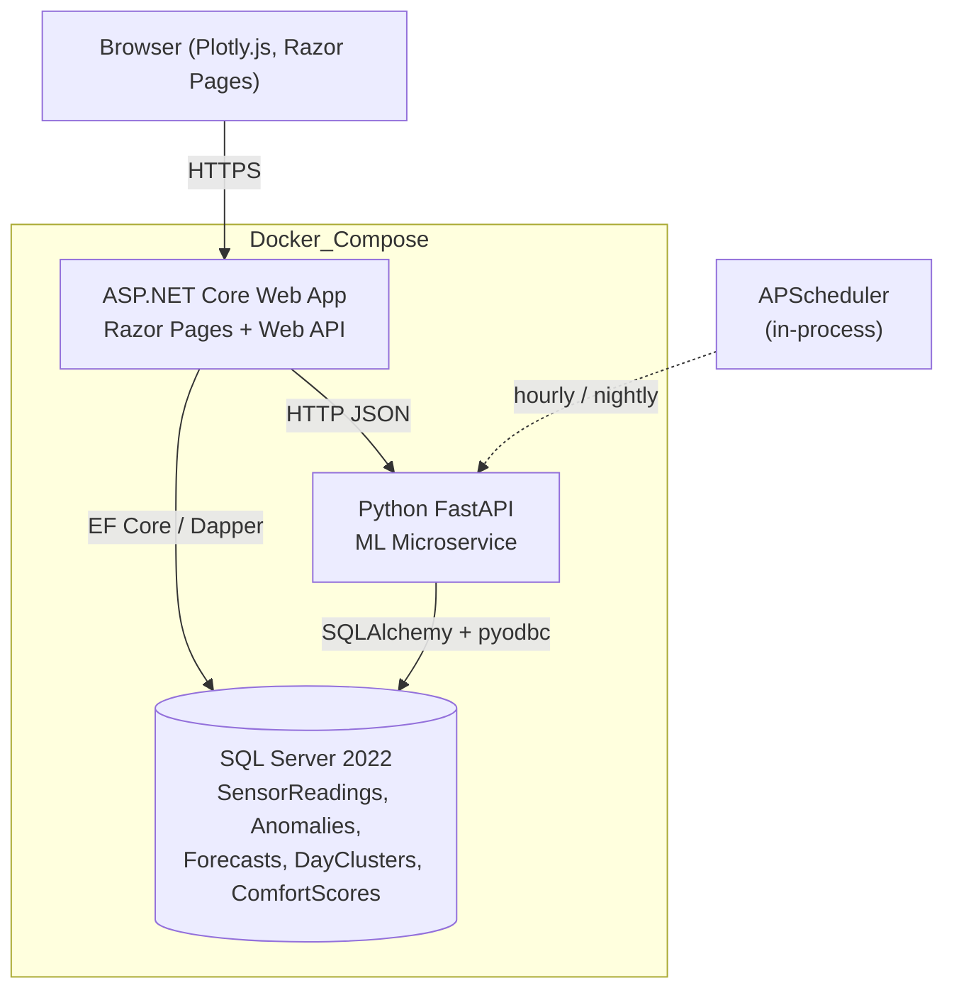
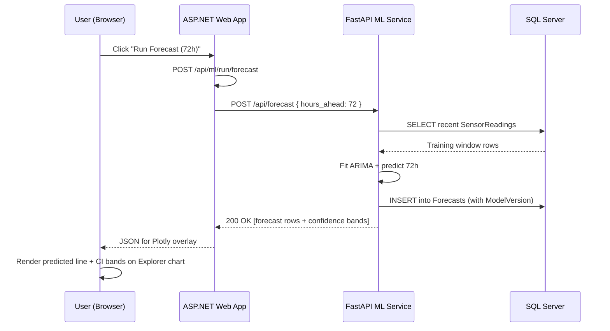
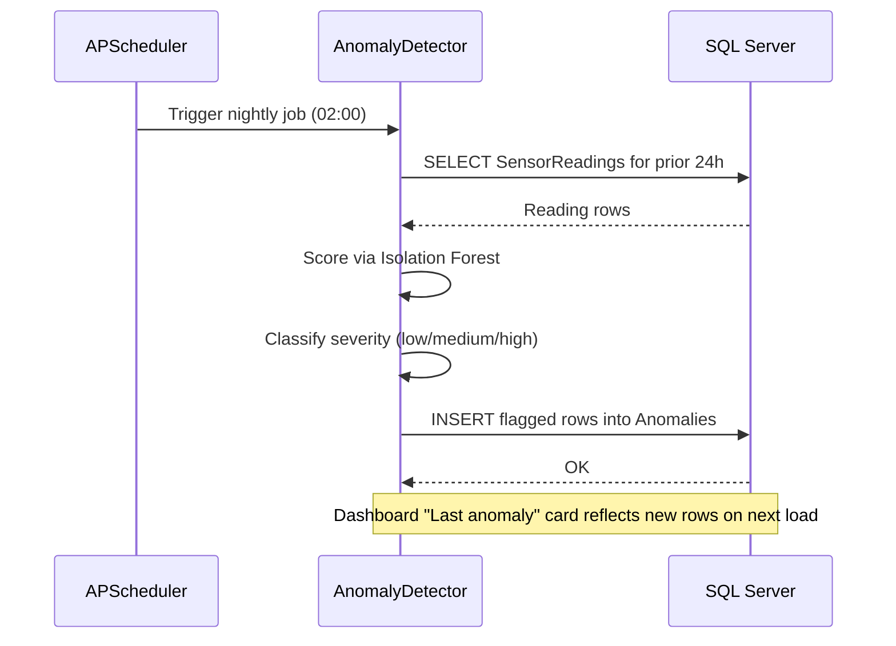
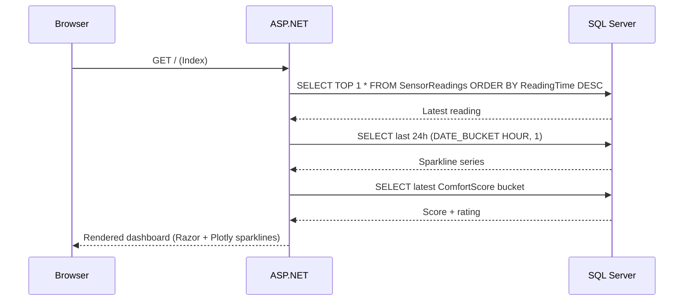

# ClimaSense

> Indoor climate monitoring, analytics, and predictive intelligence — from raw sensor data to actionable insight.


---

## Overview

ClimaSense is an end-to-end indoor climate intelligence platform built around six-plus years of real indoor temperature and humidity readings captured at five-minute intervals. It pairs an **ASP.NET Core** web application with a **Python FastAPI** machine learning microservice and **SQL Server 2022** time-series storage to turn raw sensor streams into forecasts, anomalies, behavioural clusters, and comfort scoring.

The project targets freelance reviewers, engineering leaders, and decision-makers at startups, SMBs, enterprises, and agencies. It demonstrates full-stack ownership across data ingestion, time-series SQL, REST-based polyglot architecture, machine learning, and dark-themed Plotly.js dashboards — all runnable with a single `docker compose up`.

---

## Key Features

### Live Dashboard
| Feature | Description |
| --- | --- |
| Current reading | Large-display temperature and humidity with timestamp |
| 24-hour sparklines | At-a-glance trend lines for both metrics |
| Comfort zone indicators | Color-coded "too hot / ideal / too cold" bands |
| Comfort score card | 0–100 ASHRAE-based rating with qualitative label |
| Last anomaly | Most recent ML-flagged anomaly from the prior 24 hours |

### Historical Explorer
| Feature | Description |
| --- | --- |
| Interactive charts | Zoom, pan, hover, and crosshair via Plotly.js |
| Range selector | 1D / 1W / 1M / 3M / 1Y / ALL buttons plus custom picker |
| Aggregation toggle | Raw 5-minute readings, hourly, daily, or weekly buckets |
| Min/Max bands | Overlayed envelope on aggregated series |
| Heatmap calendar | GitHub-contribution-style daily temperature intensity view |

### AI / ML Analysis
| Feature | Technique | Outcome |
| --- | --- | --- |
| Forecasting | ARIMA | 24–72 hour predictions with confidence bands |
| Anomaly detection | Isolation Forest | Severity-scored markers with drill-down details |
| Pattern clustering | K-Means | Labeled daily profiles (e.g. "warm weekday", "cool weekend") |
| Comfort scoring | ASHRAE heuristic | Hourly 0–100 comfort index trended over time |

### Alerts and Recommendations
| Feature | Description |
| --- | --- |
| Threshold rules | "Alert if temperature > X for Y minutes" configuration UI |
| Alert history | Persisted log of prior threshold breaches |
| Recommendations engine | Simulated HVAC optimization tips driven by historical clusters |
| Cost narrative | Estimated energy/risk savings framed for decision-makers |

---

## Tech Stack

| Category | Technology | Purpose |
| --- | --- | --- |
| Web framework | ASP.NET Core Razor Pages | Server-rendered pages with embedded charts |
| HTTP API | ASP.NET Core Web API | REST endpoints for sensor and ML data |
| Data access | Entity Framework Core / Dapper | Repository layer against SQL Server |
| Visualisation | Plotly.js (dark theme) | Interactive time-series, heatmap, and forecast charts |
| Database | SQL Server 2022 | Time-series storage with `DATE_BUCKET`, `GENERATE_SERIES`, `IGNORE NULLS` |
| ML runtime | Python 3 + FastAPI + Uvicorn | HTTP microservice for model training and inference |
| ML libraries | scikit-learn, statsmodels | Isolation Forest, K-Means, ARIMA |
| Data tooling | pandas, numpy, SQLAlchemy, pyodbc | Data shaping and DB I/O inside the ML service |
| Scheduling | APScheduler | Hourly forecast refresh, nightly clustering and anomaly sweeps |
| Orchestration | Docker Compose | One-command boot of DB, web, and ML containers |
| Interop | REST over HTTP (JSON) | Contracts between .NET and Python services |

---

## Architecture

ClimaSense follows a **three-tier, polyglot, containerised** design. The ASP.NET Core web tier serves pages and proxies ML calls. The Python FastAPI tier owns model training, inference, and persistence of derived results. SQL Server is the single source of truth for both raw readings and ML-derived tables, with indexed time-series access patterns.

Both services connect to the database directly — the .NET side reads sensor data and ML results for rendering, while the Python side reads raw readings and writes forecasts, anomalies, clusters, and comfort scores. Synchronous REST is used only for on-demand "Run Analysis" flows; scheduled jobs inside the Python container operate autonomously via APScheduler.



**Interaction modes**

- **Read path (dashboard / explorer):** Browser hits Razor Pages, which call the ASP.NET Web API, which queries SQL Server using time-bucketed SQL and streams JSON back to Plotly.js.
- **ML on-demand path:** Browser triggers `POST /api/ml/run/{type}` on the .NET side, which proxies to the FastAPI endpoint, which trains/infers, persists, and returns results.
- **ML scheduled path:** APScheduler inside the FastAPI container runs forecasts hourly and clustering/anomaly detection nightly, writing straight to SQL Server.

---

## Code Structure

### Planned directory layout

```
ClimaSense/
├── docker-compose.yml
├── README.md
├── src/
│   ├── ClimaSense.Web/                # ASP.NET Core Razor Pages + Web API
│   │   ├── Program.cs
│   │   ├── appsettings.json
│   │   ├── Controllers/               # Readings, Anomalies, Forecasts, Clusters, Comfort
│   │   ├── Services/                  # SensorDataService, MLServiceClient
│   │   ├── Repositories/              # Per-entity repositories over EF/Dapper
│   │   ├── Models/                    # SensorReading, Anomaly, Forecast, DayCluster, ComfortScore
│   │   ├── Data/
│   │   │   └── ClimaSenseDbContext.cs
│   │   ├── Pages/                     # Index (Dashboard), Explorer, Analysis, Alerts
│   │   └── wwwroot/
│   │       ├── css/site.css
│   │       └── js/                    # dashboard.js, explorer.js, analysis.js, plotly-config.js
│   │
│   └── ClimaSense.ML/                 # Python FastAPI ML service
│       ├── main.py                    # FastAPI app + endpoints
│       ├── config.py                  # Settings, DB URL
│       ├── database.py                # SQLAlchemy engine + session
│       ├── models/
│       │   ├── forecaster.py          # ARIMA
│       │   ├── anomaly_detector.py    # Isolation Forest
│       │   ├── clusterer.py           # K-Means on daily profiles
│       │   └── comfort.py             # ASHRAE comfort index
│       ├── schemas/                   # Pydantic request/response models
│       ├── services/
│       │   ├── data_service.py        # Reads from SensorReadings
│       │   └── persistence_service.py # Writes ML results
│       └── scheduler.py               # APScheduler jobs
│
├── data/
│   └── sensor_readings.csv            # ~630K rows per metric, 2019→present
│
└── scripts/
    ├── init-db.sql                    # Schema + indexes
    └── import-data.sql                # Bulk CSV import
```

### Class / module diagram


---

## Sequence Diagrams

### On-demand "Run Forecast" from the UI



### Scheduled nightly anomaly detection



### Dashboard load — latest reading and comfort score



---

## Data and Storage Notes

- **Dataset:** ~6 years of real indoor readings, 5-minute cadence, ~630K rows per metric, available as CSV for bulk import.
- **Raw table:** `SensorReadings` clustered on `ReadingTime` for sequential time-series scans; covering non-clustered indexes on `Temperature` and `Humidity`.
- **Derived tables:** `Anomalies`, `Forecasts`, `DayClusters`, `ComfortScores` — each indexed on its relevant time column.
- **Time-series SQL:** `DATE_BUCKET` for hourly/daily/weekly aggregation; `GENERATE_SERIES` plus `LAST_VALUE(... ) IGNORE NULLS` for gap filling across missing intervals.

---

## REST API Surface (planned)

### ASP.NET Core
```
GET  /api/readings/latest
GET  /api/readings/range?start&end&bucket=hour|day|week
GET  /api/readings/heatmap?year=2024
GET  /api/anomalies?start&end
GET  /api/forecasts/latest
GET  /api/clusters?start&end
GET  /api/comfort/current
POST /api/ml/run/{forecast|anomalies|clusters|comfort}
```

### FastAPI
```
POST /api/forecast              { hours_ahead }
POST /api/anomalies/detect      { start_date, end_date }
POST /api/clusters/analyze      { start_date, end_date }
GET  /api/comfort/score?hours=24
GET  /api/health
```

---

## Status and Roadmap

**Current status:** Planned / specification stage. No code committed yet.

| Phase | Focus | Deliverables |
| --- | --- | --- |
| Days 1–2 | Foundation | `docker-compose.yml`, `init-db.sql`, `import-data.sql`, verified time-series queries |
| Days 3–4 | ASP.NET Core API | EF Core / Dapper wiring, readings endpoints, Swagger, gap-filling range endpoint |
| Days 5–7 | Dashboard UI | Dark theme, Dashboard, Explorer, heatmap calendar, shared Plotly config |
| Days 8–10 | ML service | FastAPI scaffold, ARIMA, Isolation Forest, K-Means, ASHRAE comfort, APScheduler |
| Days 11–12 | ML into UI | Forecast overlay, anomaly markers, cluster view, comfort trend, "Run Analysis" |
| Days 13–14 | Polish | Alerts page, recommendation cards, responsive tweaks, final README + demo walkthrough |

---

## Portfolio Talking Points

- Real data — 6+ years of actual 5-minute indoor sensor readings, not synthetic.
- Polyglot architecture — .NET and Python cooperating via clean REST contracts.
- SQL Server 2022 time-series features — `DATE_BUCKET`, `GENERATE_SERIES`, `IGNORE NULLS` gap filling.
- Three distinct ML techniques — ARIMA forecasting, Isolation Forest anomaly detection, K-Means pattern clustering — plus an ASHRAE-based comfort index.
- One-command stack — `docker compose up` boots database, web app, and ML service with healthchecks.
- End-to-end ownership — schema design, ingestion, API, UI, ML pipelines, scheduling, and DevOps.

---

## License

Released under the [MIT License](./LICENSE).
