<div align="center">

# 🌡️ ClimaSense

### UPS-Room Environment Monitor — *from raw sensor rows to live operational intelligence*

A full-stack **.NET 10** dashboard that watches the temperature & humidity of a UPS / equipment room in real time — banding, history, analytics, forecasting, and alerting — reading straight from a live SQL Server with **zero ingestion and zero writes**. Backed by a **ten-year, 108-cell time-series study** that decides what models are actually worth shipping.


-FF6384?logo=chartdotjs&logoColor=white)

%20%C2%B7%20Hell%2FDunkel-444)


</div>

> **Two things worth your time:**
> 🧪 **[The data science](#-the-data-science--climate_time_series_analysisipynb)** — a fully-executed notebook (108 cells, 26 figures, PyTorch + classical models) on ten years of one-minute readings, whose headline result is *why the shipped forecaster is deliberately simple*.
> 🖥️ **[The ASP.NET Core application](#-the-application)** — a single, IIS-deployable **.NET 10** app turning a bare sensor table into Live / History / Insights dashboards, a documented JSON API, and six kinds of alert.

---

## ✨ At a glance

| | |
| --- | --- |
| 📊 **Data** | ~**3.07 M** real readings · since **2016** · ~15-min cadence · `ups3.dbo.tbl_sensor_data` |
| 🖥️ **App** | **One** ASP.NET Core (.NET 10) process · Razor Pages + Minimal API + Dapper · **read-only** |
| 🌍 **UI** | Three pages — **Live · Verlauf · Analyse** · fully **German** · persisted **light/dark** |
| 🔌 **API** | **8** documented JSON endpoints · **[OpenAPI 3.0 spec](./openapi.yaml)** · **[interactive browser docs](./docs/api.html)** |
| 🔔 **Alerting** | **6** alert kinds — breach · stale-feed · anomaly · sensor-spike · forecast · condensation |
| 🧠 **Analytics** | drift · sensor-health · linear-trend forecast · dew-point / condensation psychrometrics |
| 🧪 **Notebook** | **108** cells · **26** figures · ARIMA/SARIMA/Holt-Winters + **LSTM & 1D-CNN** |
| ✅ **Tests** | **84** xUnit (TDD) · pure domain + endpoint + opt-in DB integration |
| 🚀 **Deploy** | built on macOS (Kestrel) → **IIS in-process** (ANCM) on Windows Server |

> 🔎 **Note for reviewers:** an earlier, much larger design never shipped and is archived under [`docs/legacy/`](./docs/legacy/). Everything below — the data-science study and the ASP.NET Core app it informed — is what actually exists and runs.

---

## 🧪 The Data Science — `Climate_Time_Series_Analysis.ipynb`

The shipped forecaster is a deliberately simple linear-trend projection — and that is a *conclusion*, not a shortcut. It rests on a fully-executed **108-cell study** (60 Markdown / 48 code cells, **26 figures**) that takes a decade of raw one-minute sensor readings and asks, methodically, *how much of indoor temperature is actually predictable?* The notebook reproduces end-to-end from the raw CSV: load → clean → EDA → time-series structure → classical forecasting → sequence/deep models → leaderboard. Every number below is read straight from `assets/results.json`.

➡ [`Climate_Time_Series_Analysis.ipynb`](./Climate_Time_Series_Analysis.ipynb)

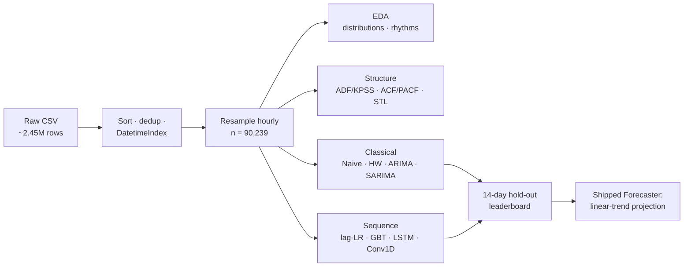
```mermaid
flowchart LR
    A[Raw CSV<br/>~2.45M rows] --> B[Sort · dedup ·<br/>DatetimeIndex]
    B --> C[Resample hourly<br/>n = 90,239]
    C --> D[EDA<br/>distributions · rhythms]
    C --> E[Structure<br/>ADF/KPSS · ACF/PACF · STL]
    C --> F[Classical<br/>Naive · HW · ARIMA · SARIMA]
    C --> G[Sequence<br/>lag-LR · GBT · LSTM · Conv1D]
    F --> H[14-day hold-out<br/>leaderboard]
    G --> H
    H --> I[Shipped Forecaster:<br/>linear-trend projection]
```

### Dataset & coverage

After sorting and removing ~600k duplicate write-burst timestamps, the cleaned record holds **2,450,920 rows** spanning **2016-01-20 → 2026-05-07 (3,759 days)**. Resampling to an hourly mean with linear gap-fill yields the modelling workhorse: **n = 90,239** evenly-spaced observations. This is one tightly-controlled room — temperature lives in a narrow band roughly 5 °C wide (σ ≈ 1.6 °C, a small coefficient of variation that screams *thermostat*), punctuated by a handful of step-changes that read like sensor relocations or HVAC reprogramming rather than weather.

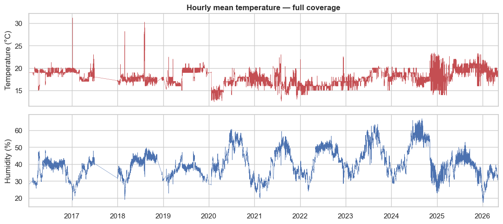

*Ten years of hourly temperature and humidity. Note the tight band and the discrete regime shifts — not a single steady state, but a sequence of controlled setpoints.*

### Exploratory analysis

The univariate distributions confirm the indoor signature: a slightly-skewed unimodal temperature centred near the setpoint, and a wider, season-spread humidity channel. The joint hexbin shows the expected **negative T↔RH correlation** — warmer air holds more water before saturating, so relative humidity falls as temperature rises — but with a broad scatter that warns against treating RH as a clean function of T.

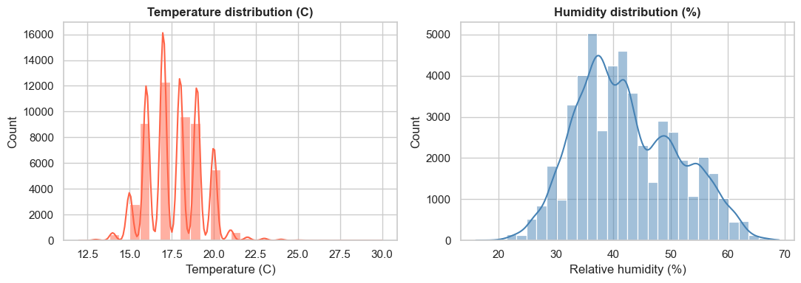 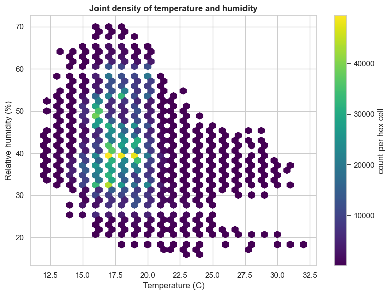

The hour × day-of-week heatmap is where time-series EDA earns its keep: a clear diurnal band (afternoons warmer than pre-dawn) with only faint weekday/weekend structure. The monthly boxplots add the slower annual envelope, and the yearly trend confirms there is **no meaningful long-run drift** — just the regime shifts already visible in the coverage plot.

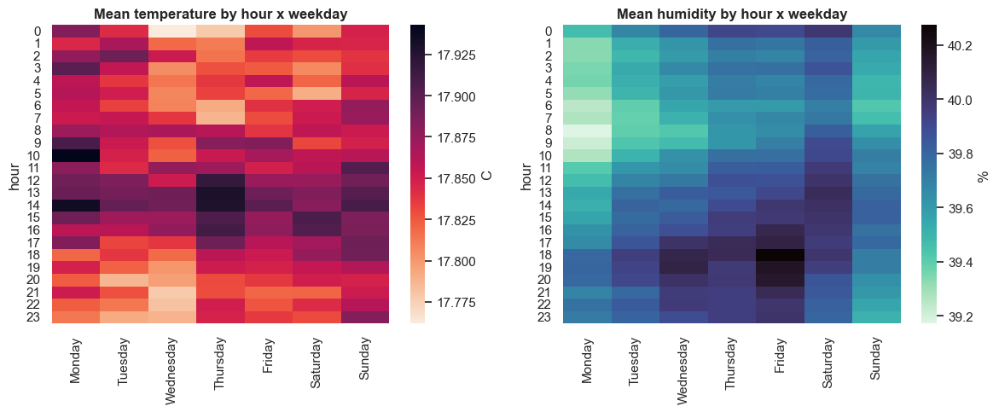 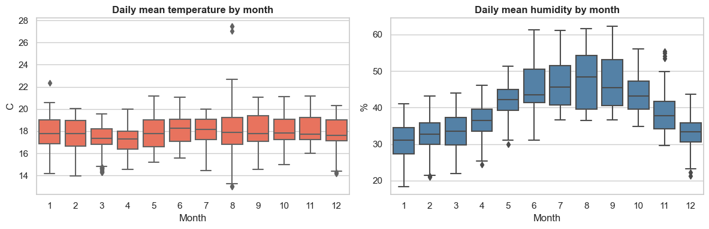

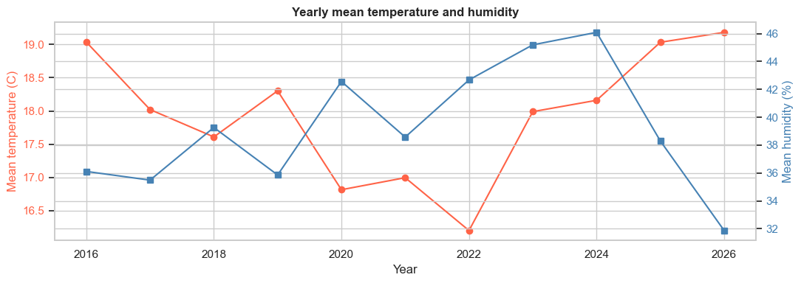

*"Indoor weather": a reliable daily rhythm and a gentle seasonal envelope riding on a flat decade-long mean.*

### Time-series structure

A 24-hour rolling mean and standard deviation stay essentially horizontal — the first two moments are stable, a visual hallmark of weak stationarity. The formal tests sharpen the picture, and they *disagree* in an informative way:

| Series (hourly, n = 90,239) | ADF stat | ADF p | KPSS stat | KPSS p | Verdict |
|---|---|---|---|---|---|
| Temperature | −9.517 | 3.13e-16 | 4.473 | 0.01 | ADF rejects unit root · KPSS rejects stationarity |
| Humidity | −4.980 | 2.43e-05 | 4.890 | 0.01 | same split |

ADF (H₀ = unit root) strongly rejects → stationary. KPSS (H₀ = stationary) also rejects → non-stationary. The reconciliation: the series is **trend-stationary / mean-reverting around a slowly-moving level** — exactly the regime where lag-feature linear models thrive and where heavy differencing (`d > 0`) only injects noise.

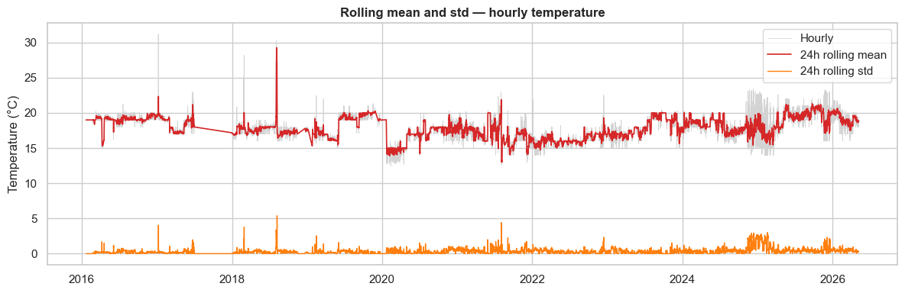

The ACF decays slowly with clean humps at lags 24, 48, and 72; the PACF spikes hard at lag 1 with a seasonal echo at lag 24. That fingerprint points squarely at a **SARIMA(p,0,q)(1,0,1,24)** family with small orders — no integration term needed.

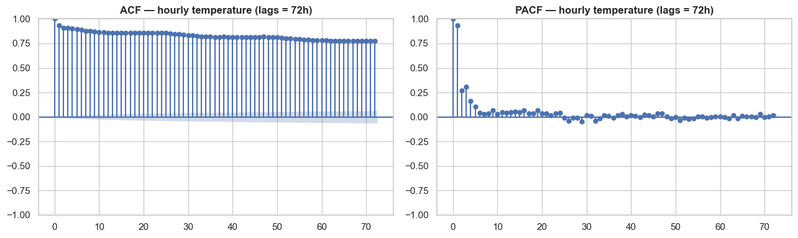

Both the additive `seasonal_decompose` (period = 24) and the more flexible STL extract a crisp 24-hour wave whose amplitude is the day-night swing, leaving a near-noise residual. The Welch periodogram closes the argument in the frequency domain: a dominant peak at **1 cycle/day** with a smaller second harmonic at 2 cycles/day, confirming the daily cycle is the single strongest mode in the data.

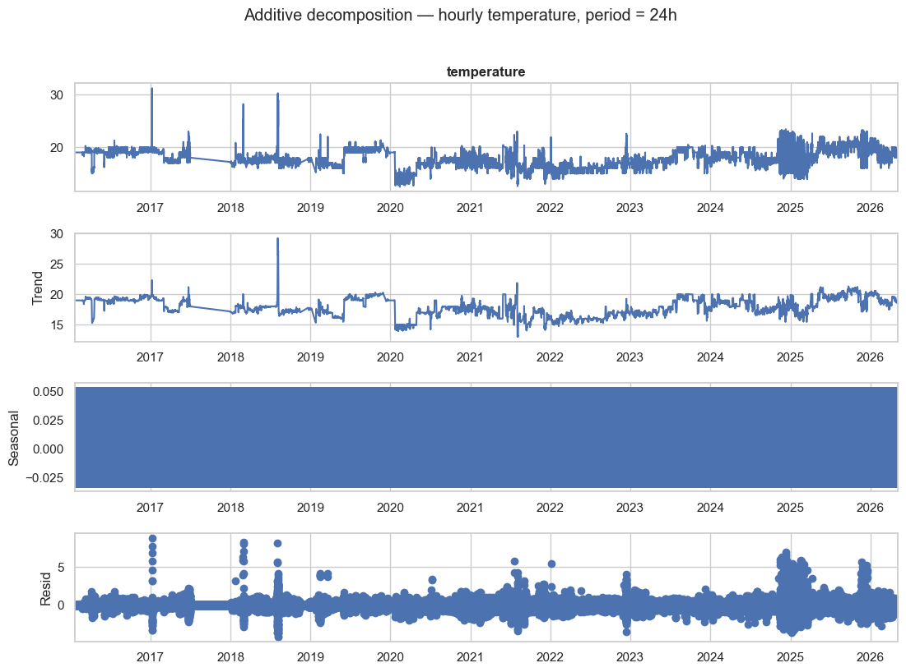 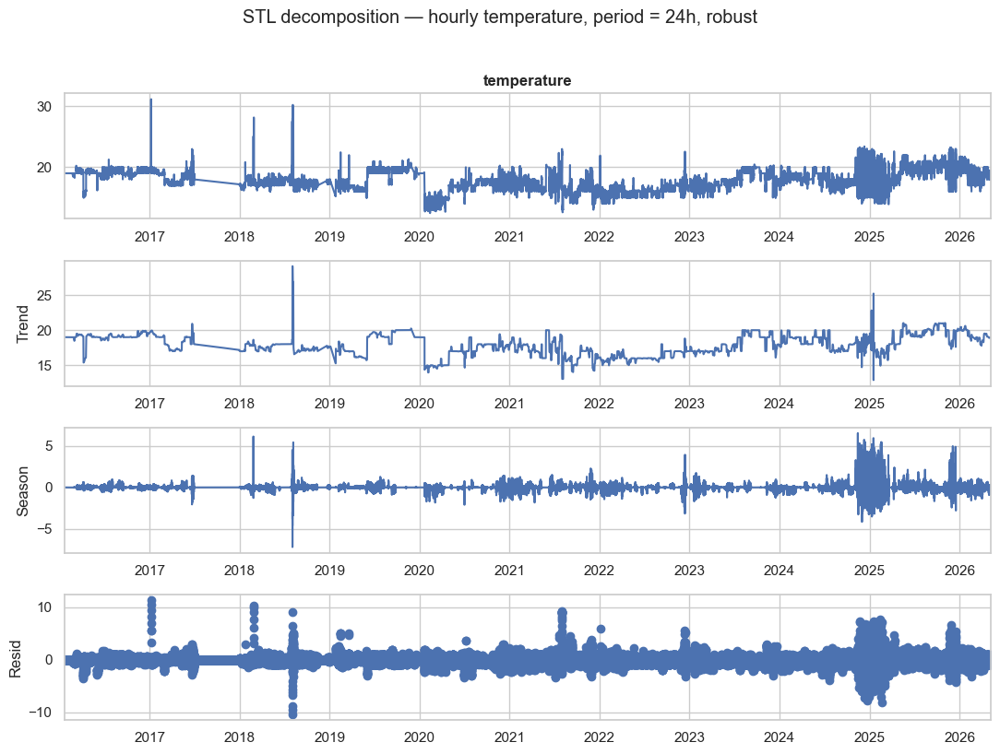

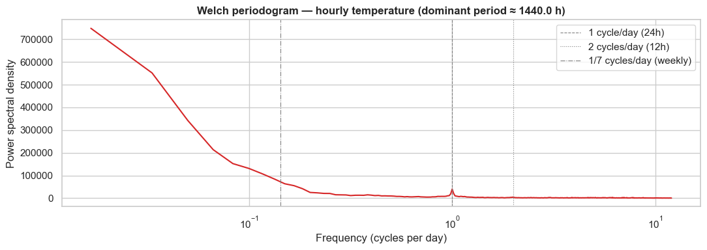

### Classical forecasting

**Protocol.** The final **14 days (336 hours)** of the hourly series are held out as a strict out-of-sample test — two full weekly cycles, so a model must generalise rather than memorise the last day. Six classical approaches are scored identically on MAE / RMSE / MAPE / sMAPE:

| Model | MAE | RMSE | MAPE | sMAPE |
|---|---|---|---|---|
| **Naive (last value)** | **0.217** | 0.370 | **1.164** | **1.153** |
| Rolling 24h mean | 0.248 | **0.320** | 1.314 | 1.313 |
| Holt-Winters (add, m=24) | 0.247 | 0.346 | 1.314 | 1.310 |
| Seasonal naive (lag-24h) | 0.307 | 0.433 | 1.627 | 1.626 |
| SARIMA(1,0,1)(1,0,1,24) | 0.344 | 0.442 | 1.836 | 1.814 |
| ARIMA(2,0,2) | 0.571 | 0.649 | 3.005 | 3.063 |

The naive last-value forecast wins on MAE and the rolling mean wins on RMSE — on a low-variance, mean-reverting signal persistence is genuinely hard to beat, and the seasonal-aware machinery (SARIMA, Holt-Winters) buys little. Plain ARIMA, blind to the daily cycle, trails badly.

 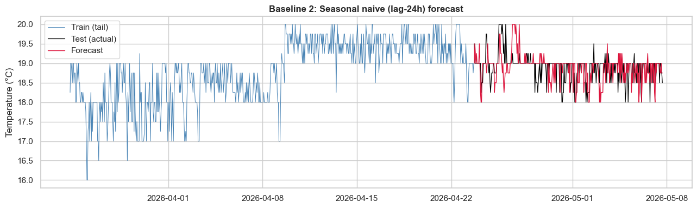

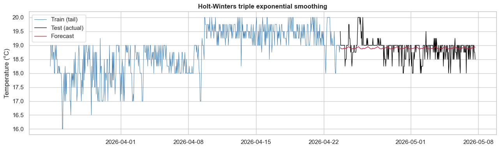 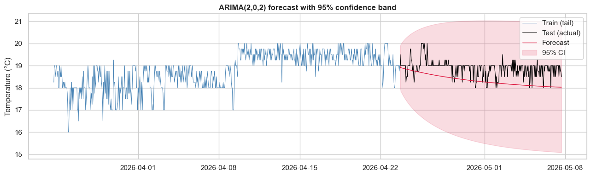

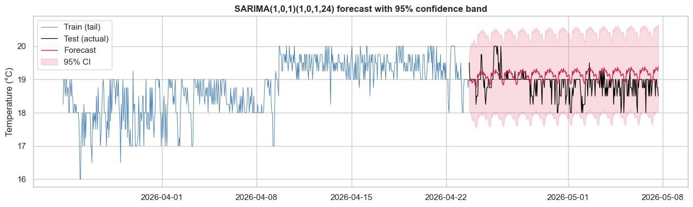

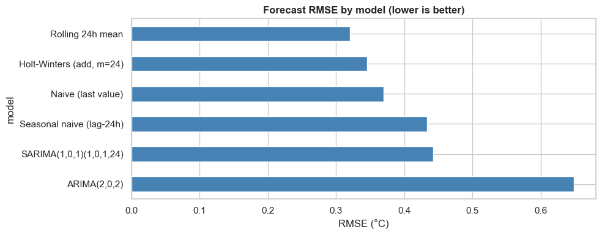

*The leaderboard, sorted by RMSE: the trivial baselines and Holt-Winters cluster tightly; plain ARIMA is the clear laggard.*

Pushing SARIMA out to multiple horizons shows the honest cost of looking further ahead — the 72-hour projection compounds error across three diurnal revolutions, and its confidence band widens accordingly. Residual diagnostics on the SARIMA fit (residuals-over-time, ACF, Q-Q, histogram) are close to white noise, confirming the model has extracted essentially all the linear structure on offer.

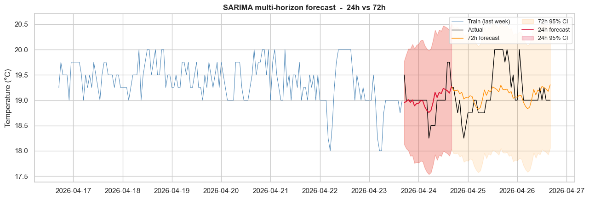 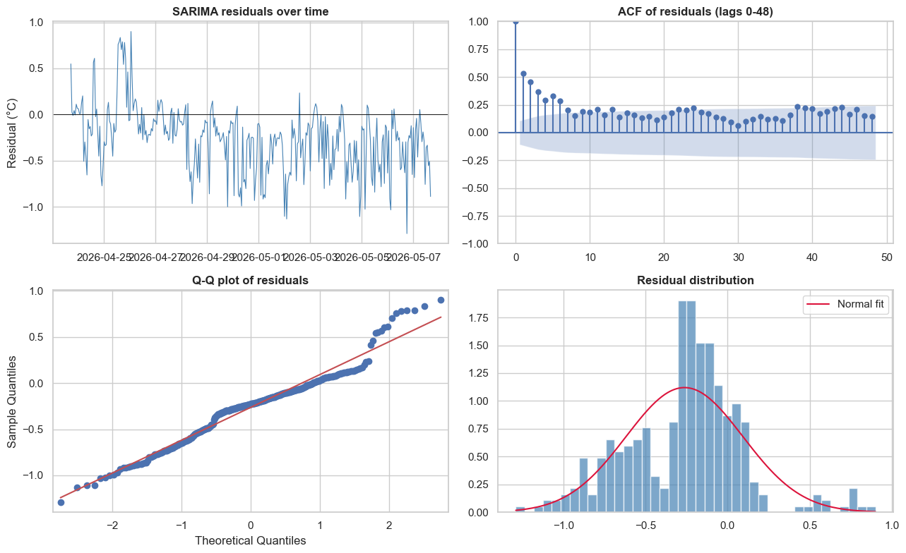

### Sequence modelling

The second half reframes forecasting as supervised learning: slide a lookback window across the series and predict the next step, augmenting raw lags with a curated set (1, 2, 3, 6, 12, 24, 48, 168 h) plus cyclical hour/day-of-week calendar encodings. Four models compete on the same hold-out:

| Model | MAE | RMSE |
|---|---|---|
| **Linear regression (lag features)** | **0.2144** | **0.2933** |
| Gradient boosting (1-step) | 0.2155 | 0.3045 |
| LSTM (PyTorch) | 0.2477 | 0.3138 |
| Conv1D (PyTorch) | 0.2658 | 0.3397 |
| Gradient boosting (recursive) | 0.5225 | 0.5965 |

A one-line linear regression on lag + cyclical features takes the top spot, with HistGradientBoosting a whisker behind. The PyTorch LSTM and Conv1D — fully trained, with the loss curve confirming convergence — land *within noise* but never ahead.

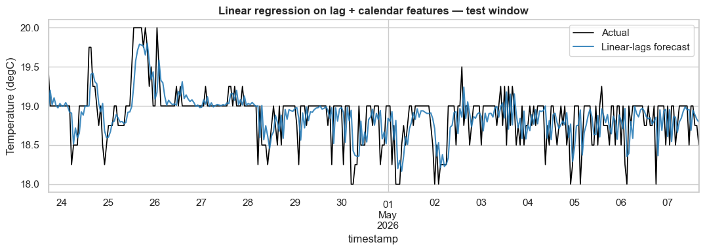 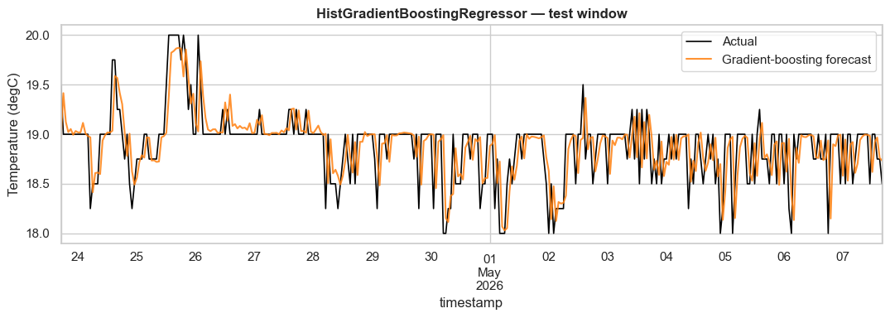

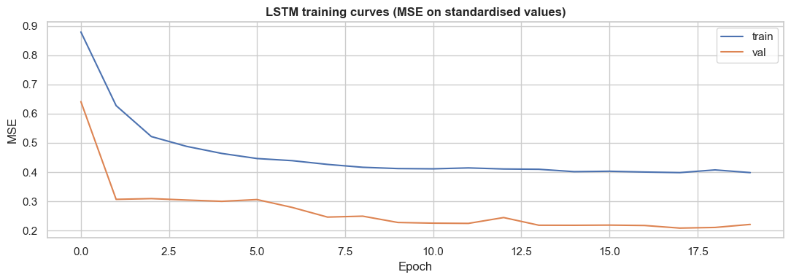 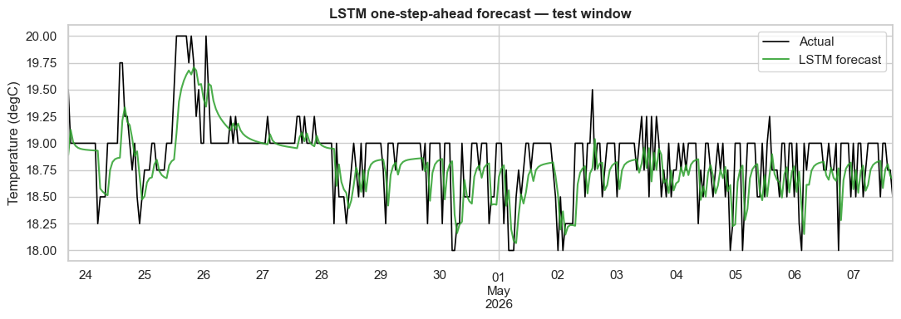

The operationally honest test — recursive multi-step rollout, where each prediction is fed back as a lag with no peeking at truth — is where the gradient-boosting forecast materially degrades (MAE 0.2155 → 0.5225), a vivid reminder that one-step metrics flatter every model.

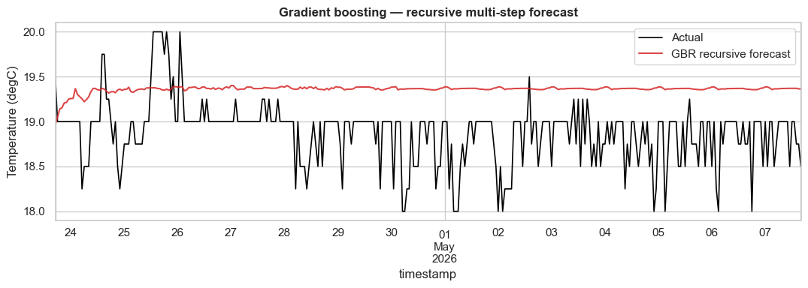 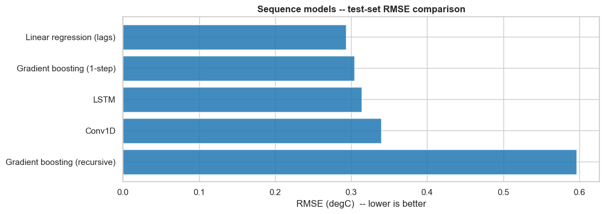

Finally, projecting the LSTM's 64-dimensional end-of-window hidden state to 2D with PCA shows it *has* internalised real structure — warm weekday blocks separate from cool weekend nights — yet that learned representation still does not translate into a forecasting edge over the linear baseline.

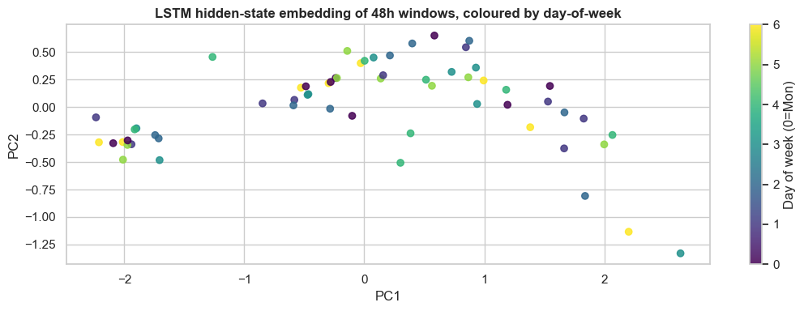

### 🏁 Headline finding

> On this low-variance, mean-reverting signal, **the simplest model wins.** A plain linear regression on a few lag terms plus cyclical hour/day-of-week encodings (MAE 0.2144) ties or beats ARIMA, SARIMA, Holt-Winters, an LSTM, and a 1D-CNN on the same 14-day window. There is little genuine short-term predictability beyond persistence and a faint daily cycle. That is precisely why the shipped `Forecaster` is a lightweight linear-trend projection rather than a heavyweight model — the deep nets cost versioning, GPUs, monitoring, and scaler artefacts to recover a delta that is statistically indistinguishable from a one-liner. Real gains here would require **exogenous regressors** — outdoor weather, occupancy, HVAC mode — not a fancier architecture.

---

## 🖥️ The Application

ClimaSense turns a plain SQL Server table — nothing but a timestamp, a whole-degree temperature, and a whole-percent humidity — into an operations dashboard for a single equipment room. It is deliberately **read-only**: no schema ownership, no ingestion job, no writes to `ups3`.

### What it does

- **Bands every reading** `Recommended / Allowable / OutOfRange` against an ASHRAE TC 9.9 data-center envelope.
- **Guards freshness** — a stale-feed banner when the sensor stops reporting (default > 30 min = two missed intervals).
- **Aggregates server-side** — `AVG/MIN/MAX` buckets keep charts snappy from 24 hours to the full ~10-year history.
- **Analyzes** — drift, sensor health, short-horizon forecasting, and dew-point / condensation-margin psychrometrics.
- **Alerts** — breach, stale-feed, in-band anomaly, sensor-spike, forecast early-warning, and condensation risk.

### Pages

#### 🟢 Live (`/`)
| Element | Description |
| --- | --- |
| Status tiles | Large temperature & humidity readouts, coloured by band; tile title annotates the status (Normal / Zulässig / Kritisch) |
| Freshness | "aktualisiert vor N Min" + a stale-feed banner past `FreshnessMinutes` |
| 24-hour trend | Dual temperature/humidity chart of the **actual** readings (not averages) |
| Active alerts | "Aktive Warnungen" panel listing currently-open breaches and a stale feed |
| Polling | Refreshes latest / 24 h series / alerts every 60 s |

#### 📈 Verlauf — History (`/history`)
| Element | Description |
| --- | --- |
| Range presets | 24 Std · 7 T · 30 T · 90 T · 1 J · **2 J · 5 J · Alle** + custom from/to picker |
| Trend charts | Temperature & humidity with Min–Max envelope bands; bucket auto-scales with the range |
| Anzeige toggle | Switch the trend chart between **Mittelwerte** (averaged + bands, default) and **Messwerte** (actual readings) |
| Calendar heatmap | One cell per day, shaded by average temperature |
| Excursions table | Contiguous out-of-band runs: Messgröße · Beginn · Ende · Dauer · Spitzenwert |

#### 🧠 Analyse — Insights (`/insights`)
| Element | Technique | Surfaces |
| --- | --- | --- |
| Psychrometrics | Magnus-formula dew point + condensation margin | Taupunkt · Abstand zur Kondensation |
| Trend | Younger-vs-older window-half mean | Steigend / Fallend / Stabil |
| Sensor health | Flat-line & jump detection | OK / Eingefroren / Ausreißer |
| Anomalies | Mean ± k·σ on in-band readings | Count of statistically unusual points |
| Forecast | Linear-trend projection per interval | Next-6 projected values + "Schritte bis Obergrenze" |

### 🎛️ Chart interaction & i18n

- **Theme-aware charts** — colours read CSS variables and rebuild on the light/dark toggle.
- **Mouse crosshair** — a vertical line tracks the hovered point, 1 pt thicker than the gridlines.
- **Drag-to-zoom** — drag a box to magnify that area (time *and* value); repeat until a single bucket remains; **⤢ Standardansicht** restores the full view.
- **German numbers** — every value renders `de-DE` (comma decimals: `8,0 °C`, `18,7`).

---

## 🏗️ Architecture

A single ASP.NET Core process. Razor Pages render the shell; vanilla JS hydrates from Minimal-API JSON endpoints; a Dapper repository (wrapped in a caching decorator) issues parameterized, read-only queries against the pre-existing `ups3` database. Pure domain logic (banding, freshness, aggregation choice, excursions, analytics, alert evaluation) is isolated from I/O — unit-testable without a database.

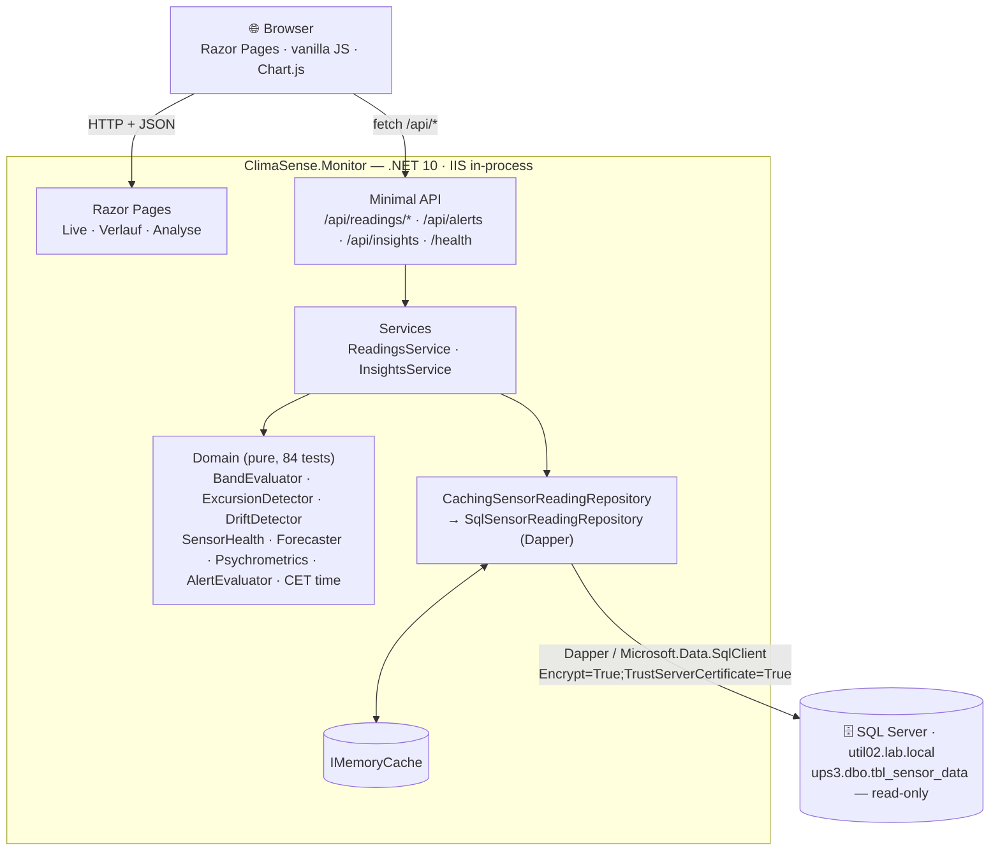
```mermaid
graph TD
    Browser["🌐 Browser<br/>Razor Pages · vanilla JS · Chart.js"]
    subgraph App["ClimaSense.Monitor — .NET 10 · IIS in-process"]
        Pages["Razor Pages<br/>Live · Verlauf · Analyse"]
        Api["Minimal API<br/>/api/readings/* · /api/alerts · /api/insights · /health"]
        Svc["Services<br/>ReadingsService · InsightsService"]
        Domain["Domain (pure, 84 tests)<br/>BandEvaluator · ExcursionDetector · DriftDetector<br/>SensorHealth · Forecaster · Psychrometrics · AlertEvaluator · CET time"]
        Repo["CachingSensorReadingRepository<br/>→ SqlSensorReadingRepository (Dapper)"]
        Cache[("IMemoryCache")]
    end
    DB[("🗄️ SQL Server · util02.lab.local<br/>ups3.dbo.tbl_sensor_data — read-only")]

    Browser -->|HTTP + JSON| Pages
    Browser -->|fetch /api/*| Api
    Api --> Svc --> Domain
    Svc --> Repo
    Repo <--> Cache
    Repo -->|"Dapper / Microsoft.Data.SqlClient<br/>Encrypt=True;TrustServerCertificate=True"| DB
```

**Failure semantics.** A DB outage/timeout is caught by `DbExceptionHandler` → `503` ProblemDetails (no stack traces leak); the UI shows "Keine Daten verfügbar" and `/health` degrades. A stale feed is a warning, not an error — the page renders, the banner shows, `/health` degrades.

### Domain model

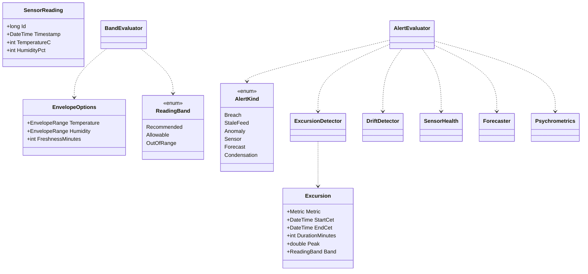
```mermaid
classDiagram
    class SensorReading {
        +long Id
        +DateTime Timestamp
        +int TemperatureC
        +int HumidityPct
    }
    class EnvelopeOptions {
        +EnvelopeRange Temperature
        +EnvelopeRange Humidity
        +int FreshnessMinutes
    }
    class ReadingBand {
        <<enum>>
        Recommended
        Allowable
        OutOfRange
    }
    class Excursion {
        +Metric Metric
        +DateTime StartCet
        +DateTime EndCet
        +int DurationMinutes
        +double Peak
        +ReadingBand Band
    }
    class AlertKind {
        <<enum>>
        Breach
        StaleFeed
        Anomaly
        Sensor
        Forecast
        Condensation
    }
    class BandEvaluator
    class ExcursionDetector
    class DriftDetector
    class SensorHealth
    class Forecaster
    class Psychrometrics
    class AlertEvaluator

    BandEvaluator ..> EnvelopeOptions
    BandEvaluator ..> ReadingBand
    ExcursionDetector ..> Excursion
    AlertEvaluator ..> AlertKind
    AlertEvaluator ..> ExcursionDetector
    AlertEvaluator ..> DriftDetector
    AlertEvaluator ..> SensorHealth
    AlertEvaluator ..> Forecaster
    AlertEvaluator ..> Psychrometrics
```

### Tech stack

| Category | Technology |
| --- | --- |
| Runtime | **.NET 10** |
| Web / API | ASP.NET Core **Razor Pages** + **Minimal API** |
| Data access | **Dapper 2.1** + Microsoft.Data.SqlClient 7.0 (parameterized, read-only) |
| Caching | `IMemoryCache` decorator (~30 s latest / ~5 min historical buckets) |
| Charts | **Chart.js** (vendored locally — no CDN) |
| Front-end | Vanilla JS + CSS-variable theming (`data-theme`), no SPA framework |
| Hosting | Kestrel (dev, macOS) → **IIS in-process / ANCM** (prod, Windows Server) |
| Tests | xUnit · `WebApplicationFactory` · Xunit.SkippableFact |

### Request lifecycle

Every data request follows the same one-way path: a thin Minimal API endpoint validates the query, a scoped service composes pure-domain analyzers over freshly fetched data, and the caching repository sits between the service and SQL Server. The browser's **Live** page re-polls `/api/readings/latest` on a 60-second interval, so the ~30-second cache on the latest reading means most polls never touch the database.

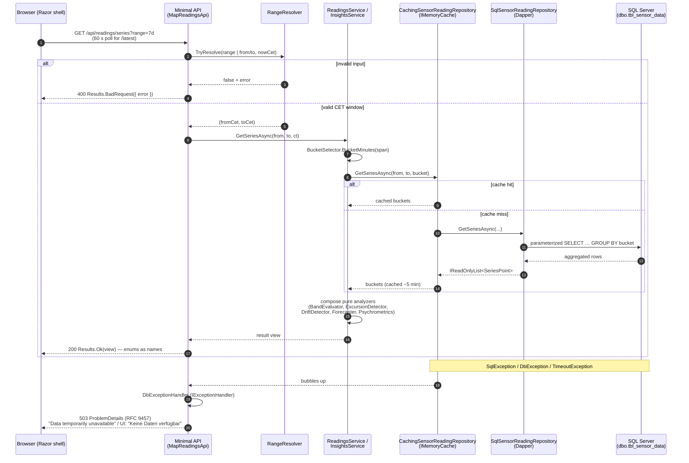
```mermaid
sequenceDiagram
    autonumber
    participant B as Browser (Razor shell)
    participant E as Minimal API<br/>(MapReadingsApi)
    participant R as RangeResolver
    participant S as ReadingsService /<br/>InsightsService
    participant C as CachingSensorReadingRepository<br/>(IMemoryCache)
    participant Q as SqlSensorReadingRepository<br/>(Dapper)
    participant DB as SQL Server<br/>(dbo.tbl_sensor_data)

    B->>E: GET /api/readings/series?range=7d<br/>(60 s poll for /latest)
    E->>R: TryResolve(range | from/to, nowCet)
    alt invalid input
        R-->>E: false + error
        E-->>B: 400 Results.BadRequest({ error })
    else valid CET window
        R-->>E: (fromCet, toCet)
        E->>S: GetSeriesAsync(from, to, ct)
        S->>S: BucketSelector.BucketMinutes(span)
        S->>C: GetSeriesAsync(from, to, bucket)
        alt cache hit
            C-->>S: cached buckets
        else cache miss
            C->>Q: GetSeriesAsync(...)
            Q->>DB: parameterized SELECT … GROUP BY bucket
            DB-->>Q: aggregated rows
            Q-->>C: IReadOnlyList<SeriesPoint>
            C-->>S: buckets (cached ~5 min)
        end
        S->>S: compose pure analyzers<br/>(BandEvaluator, ExcursionDetector,<br/>DriftDetector, Forecaster, Psychrometrics)
        S-->>E: result view
        E-->>B: 200 Results.Ok(view) — enums as names
    end

    note over C,DB: SqlException / DbException / TimeoutException
    C-->>E: bubbles up
    E->>E: DbExceptionHandler (IExceptionHandler)
    E-->>B: 503 ProblemDetails (RFC 9457)<br/>"Data temporarily unavailable" / UI: "Keine Daten verfügbar"
```

`RangeResolver` accepts either a named preset (`24h`, `7d`, `30d`, `90d`, `1y`, `2y`, `5y`, `all`) or an explicit `from`/`to` pair, rejecting reversed bounds and windows wider than two years. The `raw` endpoint returns every reading up to `ReadingsService.MaxRawDays` (210 days) and **min/max-decimates** beyond that (the recorded extremes per bucket), so the un-aggregated view stays bounded for any range.

### Design paradigms & patterns

The codebase is deliberately layered so that **all analysis is pure and I/O lives only at the edges**. Domain types are `readonly record struct`s and the analyzers are `static` classes with no dependencies on ASP.NET, Dapper, or a clock — they take a series and options in, and return a result. That seam is what makes ~80 tests run with no database.

| Pattern | Where it lives | Why |
| --- | --- | --- |
| Minimal API vs. Razor Pages | `MapReadingsApi` (JSON endpoints) over a Razor Pages shell (HTML) | Razor renders the page chrome once; all live data flows over JSON, so the UI is just `fetch` + Chart.js |
| Repository | `ISensorReadingRepository` | Abstracts the data source; services depend on the interface, never on `SqlConnection` |
| Decorator | `CachingSensorReadingRepository` wraps `SqlSensorReadingRepository` | Transparent caching with zero changes to callers — the DI container composes the two by hand in `Program.cs` |
| Options | `EnvelopeOptions` bound from the `Envelope` config section, injected as `IOptions<EnvelopeOptions>` | Comfort/allowable bands and `FreshnessMinutes` are configuration, not constants |
| Dependency Injection + lifetimes | Singleton repository/`IClock`/`IMemoryCache`; scoped `ReadingsService` / `InsightsService` | Long-lived infrastructure shared safely; per-request services kept cheap |
| Clock seam | `IClock` / `SystemClock`, with `CetZone` for CET↔UTC | Deterministic, testable time; correct DST handling (invalid spring-forward wall-clock instants are nudged forward by 1 h) |
| Problem Details (RFC 9457) | `DbExceptionHandler : IExceptionHandler` | DB faults map to `503` with a clean `ProblemDetails` body — no stack traces leak to clients; non-DB faults fall through to the default `500` |
| Health Checks | `DbFeedHealthCheck` mapped at `/health` | Reports `Healthy` / `Degraded` (no rows or stale feed) / `Unhealthy` (DB error) for external probes |
| Pure domain core | `BandEvaluator`, `ExcursionDetector`, `DriftDetector`, `SensorHealth`, `Forecaster`, `Psychrometrics`, `AlertEvaluator` | Side-effect-free analysis, unit-testable in isolation; the database is never required to test logic |
| Server-side aggregation + auto bucket | `BucketSelector` (15 min → 1 month by span) | Keeps payloads small regardless of window — a 5-year query returns weekly/monthly buckets, not millions of rows |
| Strict read-only | SELECT-only Dapper queries; recommended `climasense_ro` least-privilege login | The app can only read; there is no write path |

The analyzers are themselves composable. `AlertEvaluator` reuses `ExcursionDetector` (band breaches), `DriftDetector` (in-band statistical anomalies as an early-warning signal), `SensorHealth` (implausible spikes), `Forecaster` (steps-to-threshold projection), and `Psychrometrics` (condensation margin) to fold one window into a single ordered alert list — each piece independently tested.

### Frameworks & libraries (how they're used)

Building on the tech-stack table above, the notable usage details are:

| Component | How it is used here |
| --- | --- |
| ASP.NET Core 10 | Minimal API endpoint groups (`/api/readings/*`, `/api/alerts`, `/api/insights`) layered over Razor Pages for the page shell and static assets |
| Dapper + Microsoft.Data.SqlClient | Fully parameterized `SELECT`/`GROUP BY` against `dbo.tbl_sensor_data`; per-query `CommandTimeout` (15 s latest, 30 s aggregates); `Encrypt=True;TrustServerCertificate=True` for the self-signed server cert |
| `IMemoryCache` decorator | ~30 s TTL on the latest reading; ~5 min absolute expiry on historical series/daily/raw buckets, keyed by `from:to:bucket` |
| `JsonStringEnumConverter` | Registered via `ConfigureHttpJsonOptions` so enums (`ReadingBand`, `Metric`, `AlertKind`, `DriftDirection`, `SensorStatus`) serialize as readable names, not integers |
| `CultureInfo("de-DE")` | Set as the default thread culture in `Program.cs`; the German UI and alert strings ("Kondensationsrisiko", "Datenfeed veraltet …") format consistently |
| Chart.js | Vendored locally under `wwwroot/lib/chartjs` — no CDN dependency, so the dashboard runs in an isolated equipment-room network |
| OpenAPI 3.0.3 + Redoc | `openapi.yaml` is the published wire contract; Redoc renders human-readable API docs from it |

### Engineering methodologies & practices

The project was built test-first and contract-first, delivered as a sequence of thin vertical slices.

- **Test-driven, layered test strategy (xUnit).** The suite is **84 tests (80 run by default, 4 DB integration tests skipped without a connection)**, organised by layer:
  - `tests/.../Domain/` — pure unit tests for every analyzer (`BandEvaluatorTests`, `ExcursionDetectorTests`, `DriftDetectorTests`, `SensorHealthTests`, `ForecasterTests`, `PsychrometricsTests`, `BucketSelectorTests`, `AlertEvaluatorTests`, `TimeTests`, `EnvelopeOptionsTests`).
  - `tests/.../Endpoints/` — `ApiTests` boot the real app through `WebApplicationFactory<Program>` with fake/throwing repositories swapped into DI, asserting status codes and JSON shape — including that a DB fault surfaces as a `503 ProblemDetails`. `RangeResolverTests` and `PagesTests` cover validation and the HTML shell.
  - `tests/.../Services/` — `ReadingsServiceTests` exercise band classification, freshness, and the raw-range cap against an in-memory repository.
  - `tests/.../Integration/` — `SqlSensorReadingRepositoryTests` use `Xunit.SkippableFact` and `Skip.If` on the `CLIMASENSE_UPS3_CONNECTION` env var, so they run only when a real `ups3` database is reachable; a plain `dotnet test` needs no database.
- **Contract-first API.** `openapi.yaml` (OpenAPI 3.0.3) is treated as the wire contract for the JSON endpoints, with Redoc as the rendered reference.
- **Vertical-slice delivery.** Work was sequenced as **13 documented slices** (`docs/legacy/slice-notes/SLICE-1..13-NOTES.md`) against a single design spec and plan under `docs/superpowers/`, each slice shippable end-to-end (endpoint → service → domain → tests) rather than built layer-by-layer.
- **Configuration & secrets discipline.** The connection string is read from `ConnectionStrings:Ups3` or the `CLIMASENSE_UPS3_CONNECTION` environment variable and is never committed; the app fails fast at startup if neither is set. The recommended deployment uses a least-privilege `climasense_ro` login with `SELECT` on the single table.
- **Clean failure semantics.** A database outage becomes a `503` with a friendly "data unavailable" message (UI shows "Keine Daten verfügbar") rather than a crash; a stale feed is a warning, not an error; and `/health` degrades accordingly so external monitoring can distinguish "down" from "lagging".

---

## 🔌 API Reference

Read-only JSON over HTTP. The machine-readable contract is **[`openapi.yaml`](./openapi.yaml)** (OpenAPI 3.0 — 8 paths, 17 schemas), with per-endpoint descriptions, multiple named request/response examples, `curl` snippets, and the full envelope/bucket/error model.

**📖 Interactive, browser-viewable reference: [`docs/api.html`](./docs/api.html).** A self-contained [Redoc](https://redocly.github.io/redoc/) page — **just open it in any browser** (double-click locally, or host it on GitHub Pages). It embeds the spec, so it works offline of any server; external bundles are version-pinned with Subresource Integrity. It is generated from `openapi.yaml` (the single source of truth) — regenerate after editing the spec:

```bash
python3 scripts/build-api-html.py      # → docs/api.html
```

Prefer not to open the HTML? Paste `openapi.yaml` into the [Swagger Editor](https://editor.swagger.io/) instead.

| Method | Endpoint | Returns |
| --- | --- | --- |
| `GET` | `/api/readings/latest` | Latest reading + bands + freshness |
| `GET` | `/api/readings/series` | Bucketed avg/min/max series |
| `GET` | `/api/readings/daily` | Per-day aggregates (heatmap) |
| `GET` | `/api/readings/excursions` | Contiguous out-of-band runs |
| `GET` | `/api/readings/raw` | Actual (un-averaged) readings — individual ≤210 d, min/max-decimated beyond |
| `GET` | `/api/alerts` | Evaluated alerts |
| `GET` | `/api/insights` | Psychrometrics + per-metric analytics |
| `GET` | `/health` | DB connectivity + feed freshness |

**Range parameters** (series / daily / excursions / alerts / insights): pass **either** `range` **or** `from`+`to`.

| Param | Type | Notes |
| --- | --- | --- |
| `range` | enum | `24h` · `7d` · `30d` · `90d` · `1y` · `2y` · `5y` · `all` |
| `from` | date-time | Inclusive start, **CET wall-clock** (e.g. `2026-06-01T00:00:00`) |
| `to` | date-time | Exclusive end, **CET wall-clock** |

Bad input → `400 { "error": "…" }`. DB down → `503` ProblemDetails. Enums serialize as **names** (`"Recommended"`, `"Breach"`). All `*Cet` timestamps are CET, no offset.

<details>
<summary><b>GET /api/readings/latest</b> — latest status (or <code>null</code> when empty)</summary>

```jsonc
{
  "reading": { "id": 3069301, "timestamp": "2026-06-15T22:45:00", "temperatureC": 21, "humidityPct": 47 },
  "tempBand": "Recommended",        // Recommended | Allowable | OutOfRange
  "humidityBand": "Recommended",
  "overall": "Recommended",         // worst-of the two
  "minutesOld": 4,
  "isStale": false                  // true once older than FreshnessMinutes (30)
}
```
</details>

<details>
<summary><b>GET /api/readings/series?range=7d</b> — bucketed series (array)</summary>

Bucket auto-scales: `≤2 d → 15 min · ≤14 d → 60 min · ≤90 d → 6 h · ≤2 y → 1 day · ≤5 y → 1 week · else → ~monthly`.

```jsonc
[
  { "bucketStartCet": "2026-06-15T21:00:00",
    "avgTemp": 21.2, "minTemp": 21, "maxTemp": 22,
    "avgHumidity": 47.4, "minHumidity": 46, "maxHumidity": 49,
    "count": 4 }
]
```
</details>

<details>
<summary><b>GET /api/readings/daily?range=30d</b> — per-day aggregates (array)</summary>

```jsonc
[
  { "dateCet": "2026-06-14",
    "avgTemp": 21.3, "minTemp": 20, "maxTemp": 23,
    "avgHumidity": 48.1, "minHumidity": 44, "maxHumidity": 52,
    "count": 96 }
]
```
</details>

<details>
<summary><b>GET /api/readings/excursions?range=30d</b> — out-of-band runs (array)</summary>

```jsonc
[
  { "metric": "Temperature",                 // Temperature | Humidity
    "startCet": "2026-06-10T13:00:00",
    "endCet": "2026-06-10T16:00:00",
    "durationMinutes": 180,
    "peak": 28.5,                             // furthest from the Recommended band
    "band": "Allowable" }
]
```
</details>

<details>
<summary><b>GET /api/readings/raw?range=24h</b> — actual readings (array)</summary>

Individual readings, not averages (Live, and the History **Messwerte** toggle). Every reading up to ~210 days; beyond that, min/max-decimated to the recorded extremes per bucket — works for any range.

```jsonc
[
  { "timestampCet": "2026-06-15T10:15:04.497", "temperatureC": 17, "humidityPct": 49 },
  { "timestampCet": "2026-06-15T10:30:04",     "temperatureC": 18, "humidityPct": 53 }
]
```
</details>

<details>
<summary><b>GET /api/alerts?range=24h</b> — evaluated alerts (array)</summary>

`endCet: null` marks an **active** alert. Messages are German.

```jsonc
[
  { "kind": "Breach", "metric": "Temperature",
    "startCet": "2026-06-10T13:00:00", "endCet": null,
    "severity": "Allowable", "message": "Temperatur Zulässig seit 13:00 (laufend)" },
  { "kind": "Condensation", "metric": null,
    "startCet": "2026-06-15T22:45:00", "endCet": null,
    "severity": "Allowable", "message": "Kondensationsrisiko: 2,4 °C über Taupunkt" }
]
// kind ∈ Breach | StaleFeed | Anomaly | Sensor | Forecast | Condensation
```
</details>

<details>
<summary><b>GET /api/insights?range=7d</b> — psychrometrics + analytics (or <code>null</code>)</summary>

```jsonc
{
  "temperature": {
    "metric": "Temperature",
    "drift": "Stable",                        // Rising | Falling | Stable
    "anomalies": [],                          // { bucketStartCet, value, score(σ) }
    "sensorHealth": "Healthy",                // Healthy | Stuck | Spike
    "forecast": [21.0, 21.0, 20.9, 20.9, 20.8, 20.8],
    "stepsToBreach": null                     // intervals to the upper limit, or null
  },
  "humidity": { "metric": "Humidity", "drift": "Rising", "anomalies": [], "sensorHealth": "Healthy",
                "forecast": [47.0, 47.4, 47.8, 48.2, 48.6, 49.0], "stepsToBreach": null },
  "dewPointC": 9.4,
  "condensationMarginC": 11.6
}
```
</details>

---

## 📂 Project structure

```
ClimaSense/
├── README.md
├── openapi.yaml                            # OpenAPI 3.0 — the API contract
├── ClimaSense.sln
├── Climate_Time_Series_Analysis.ipynb      # the data-science notebook
├── assets/                                 # 26 notebook figures + results.json
├── docs/
│   ├── api.html                            # browser-viewable API reference (Redoc; generated)
│   ├── DEPLOY.md                           # IIS deployment guide
│   ├── legacy/                             # archived earlier design (ADRs, glossary, slice notes)
│   └── superpowers/{specs,plans}/          # Monitor design spec + implementation plan
├── scripts/
│   ├── build-api-html.py                   # regenerates docs/api.html from openapi.yaml
│   ├── ups3-index.sql                      # recommended nonclustered index on sensor_dateTime
│   └── climasense_ro.sql                   # least-privilege read-only login
├── src/ClimaSense.Monitor/
│   ├── Program.cs                          # DI · de-DE culture · endpoints · ProblemDetails · health
│   ├── Domain/      SensorReading · EnvelopeOptions · BandEvaluator · Excursion · Aggregation
│   │                Time (CET) · Alert · DriftDetector · SensorHealth · Forecaster · Psychrometrics
│   ├── Data/        ISensorReadingRepository · SqlSensorReadingRepository · CachingSensorReadingRepository
│   ├── Services/    ReadingsService · InsightsService · LatestStatus · DbExceptionHandler · DbFeedHealthCheck
│   ├── Endpoints/   ReadingsApi (+ RangeResolver)
│   ├── Pages/       Index (Live) · History (Verlauf) · Insights (Analyse) · Shared/_Layout
│   └── wwwroot/     css/site.css · js/{live,history,insights,charts,theme,site}.js · lib/chartjs
└── tests/ClimaSense.Monitor.Tests/         # Domain · Endpoints · Services · opt-in Integration
```

---

## 🚀 Running locally

```bash
# 1. Point the app at the database (env var or ConnectionStrings:Ups3)
export CLIMASENSE_UPS3_CONNECTION='Server=util02.lab.local,1433;Database=ups3;User Id=<your-db-user>;Password=…;Encrypt=True;TrustServerCertificate=True'

# 2. Run on Kestrel
dotnet run --project src/ClimaSense.Monitor      # → http://localhost:5181

# 3. Tests (DB-integration tests auto-skip unless the env var is set)
dotnet test
```

IIS deployment (Hosting Bundle · in-process app pool · env-var secret) is documented step-by-step in **[`docs/DEPLOY.md`](./docs/DEPLOY.md)**.

---

## ✅ Testing

**84 tests** (xUnit), written test-first:

- **Pure domain** — band classification, freshness, bucket selection, excursion detection, drift, sensor health, forecasting, psychrometrics, CET↔UTC conversion (incl. the DST spring-forward gap), alert evaluation.
- **Endpoints** — `WebApplicationFactory` smoke + shape checks, range-resolver validation, page renders.
- **Services** — caching-repository behaviour, reading composition.
- **Integration (opt-in)** — 4 `SkippableFact` tests verify real query shape/aggregation against `ups3`; they skip unless the connection env var is set, so default `dotnet test` needs no database.

---

## 🔐 Security posture

- **Secret** lives in `CLIMASENSE_UPS3_CONNECTION` (or an encrypted `web.config` section) — never committed.
- **Least privilege (recommended).** The app currently connects as `<your-db-user>`, which is a **`sysadmin`** — far more than a read-only dashboard needs. `scripts/climasense_ro.sql` creates a `climasense_ro` login with `SELECT` on the one table; switch the connection string to it in production.
- **Transport** — `Encrypt=True;TrustServerCertificate=True` (util02's cert is self-signed).
- **Read-only** — the app issues only `SELECT`; it never writes to `ups3`.

---

## 📜 History & license

An earlier, larger platform design (replay clock, a separate ML service, SSE streaming, ASHRAE comfort scoring) never shipped and is preserved for reference under **[`docs/legacy/`](./docs/legacy/)**. The current design spec lives at [`docs/superpowers/specs/`](./docs/superpowers/specs/).

Released under the **MIT License**.
