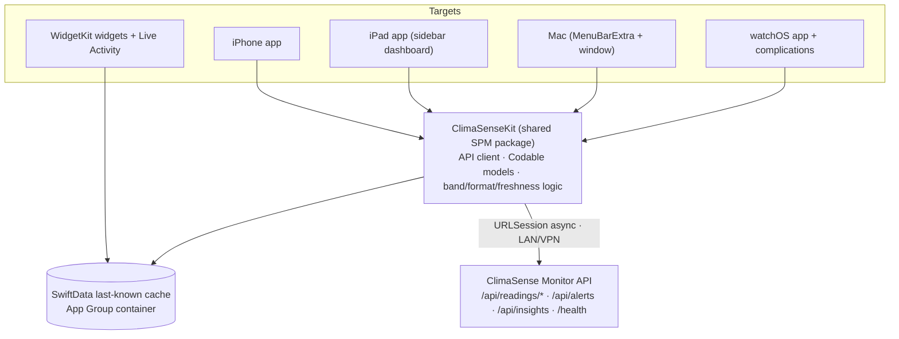

# ClimaSense iOS Pendant — Design Spec

- **Date:** 2026-06-16
- **Status:** Approved design, ready for implementation planning
- **Relationship:** iOS-family counterpart ("Pendant") to the **ClimaSense Monitor** — the read-only .NET 10 ASP.NET Core dashboard over the `ups3` UPS-room sensor feed.

## 1. Summary

A native Apple-ecosystem app that mirrors the ClimaSense Monitor on the go. It is **read-only** and consumes the Monitor's existing **OpenAPI 3.0 JSON API** (`/api/readings/*`, `/api/alerts`, `/api/insights`, `/health`) over the lab **LAN/VPN** — no new backend, no writes, no changes to the server's security posture.

It is built to be **both** a genuinely useful on-call tool **and** a portfolio-grade showcase, spanning the full Apple ecosystem: iPhone, a bespoke iPad dashboard, a Mac menu-bar + window app, an Apple Watch app + complications, Home/Lock-Screen widgets, and a Live Activity.

## 2. Goals & non-goals

**Goals**
- Glanceable, on-call visibility of the UPS room (temperature/humidity band status, freshness, trend, alerts) from phone, wrist, desktop and widgets.
- Faithful reuse of the server's domain language (bands `Normal/Zulässig/Kritisch`, psychrometrics, the six alert kinds) so the two products feel like one system.
- Showcase adaptive, multi-platform SwiftUI with a clean shared core.

**Non-goals**
- No writes to `ups3` or the server (read-only mirror).
- No public backend, cloud relay, or APNs sender — connectivity is **LAN/VPN-only** (accepted limitation: no off-network push).
- No changes to the Monitor's auth (it stays unauthenticated on the LAN).
- No full offline history mirror (we cache last-known + a recent window only).

## 3. Decisions captured from the brainstorm

| Topic | Decision |
| --- | --- |
| Primary intent | Both — a real on-call tool **and** portfolio-grade, against the live API |
| Connectivity | **LAN/VPN-only** — app talks directly to the Monitor API; alerts via polling + local notifications while reachable |
| Data architecture | **Live + last-known cache** (SwiftData, App Group) |
| Surfaces | iPhone · iPad (bespoke) · Mac (menu-bar + window) · Watch (app + complications) · widgets · Live Activity |
| iPhone Live screen | **Tiles + trend** (band-coloured Temp/Feuchte tiles, freshness line, 24 h sparkline, alerts list) |
| iPad | **Sidebar app** — left nav (Live · Verlauf · Analyse) + rich multi-card grid |
| Mac | **MenuBarExtra + dashboard window**; menu-bar shows `● 21°` by default (preference: dot-only / temp / temp + humidity) |
| Localization | German-primary (de-DE, matches the server) + English |

## 4. Architecture

A SwiftUI multiplatform app over a single shared Swift package. All analysis-free presentation; data flows one way (read).

**Components**

- **`ClimaSenseKit` (shared SPM package)** — the single source of truth for the client:
  - `ClimaSenseClient` — `URLSession` async/await; one method per endpoint; configurable base URL (the LAN/VPN host); decodes JSON into typed models. Treats `*Cet` timestamps as **Europe/Berlin wall-clock, no offset** (matching the server) and converts for display.
  - **Codable models** mirroring the OpenAPI schemas: `LatestStatus`, `SensorReading`, `SeriesPoint`, `DailyAggregate`, `RawPoint`, `Excursion`, `Alert`, `AnomalyPoint`, `MetricInsight`, `Insights`, plus the enums (`ReadingBand`, `Metric`, `AlertKind`, `DriftDirection`, `SensorStatus`) — wire values stay English; display labels are localized.
  - **On-device presentation logic** — band → German label + colour, dew-point / "Δ zur Kondensation" formatting, freshness ("aktualisiert vor N Min" + stale flag past a threshold), de-DE number formatting. This is presentation only; the server remains the source of computed analytics (forecast, excursions, anomalies, psychrometrics) which the app just renders.
- **SwiftData last-known cache** in an **App Group** container so widgets, the complication, the Watch app and the main apps all read the same snapshot without each hitting the LAN API. Every successful fetch refreshes it; off-VPN the UI renders cached values with a stale badge.
- **Reachability** (Network framework) drives a connection indicator and a clear "nicht im Labornetz" state that still shows last-known data.

## 5. Data & cache model

- **Transport models**: as the API returns them (Section 4). A thin mapping layer converts CET strings to `Date` for charting.
- **Cache entities (SwiftData)**:
  - `LatestSnapshot` — the latest `LatestStatus` + fetch timestamp.
  - `SeriesCacheEntry` — the most recent series window per range key (e.g. `24h`, `7d`) for trend charts/widgets.
  - `AlertCacheEntry` — currently-open alerts (for the alerts list, notifications de-duplication, and Live Activity state).
- **Freshness** is derived the same way as the server: `minutesOld` from the latest reading vs. now; "stale" past a configurable threshold (default mirrors the server's 30 min).

## 6. Surfaces & UX

All surfaces share the band colour language (green `Normal` · amber `Zulässig` · red `Kritisch`) and recolour with status.

- **iPhone — *Tiles + trend*.** A tab/stack app: **Live** (two band-coloured tiles Temperatur/Feuchte, "aktualisiert vor N Min", a 24 h sparkline of actual readings, an "Aktive Warnungen" list), **Verlauf** (range presets 24 Std…Alle, Min–Max trend + Mittelwerte/Messwerte toggle, calendar heatmap, excursions), **Analyse** (psychrometrics, drift, sensor health, anomalies, forecast + steps-to-limit). Polls latest/series/alerts while in the foreground.
- **iPad — *Sidebar app*.** A left sidebar (Live · Verlauf · Analyse) with a rich multi-card main grid: status tiles + dew-point, a large Min–Max trend, alerts and forecast side-by-side. Tailored for the larger canvas, not a stretched iPhone view. (A future "kiosk/wall-display" mode is noted as a possible later toggle, out of MVP scope.)
- **Mac — *MenuBarExtra + window*.** A menu-bar item showing a band dot + temperature (`● 21°` default; user preference for dot-only / temp / temp + humidity), with a popover (mini tiles, freshness, active alerts, "Dashboard öffnen"). The full window reuses the iPad sidebar layout, Mac-native (traffic-light chrome, a toolbar with range chips + light/dark toggle, keyboard navigation).
- **Apple Watch — *app + complications*.** App: large band-coloured temperature, status, humidity, freshness, alert indicator. Complications: circular (temp + band ring), inline, and corner.
- **Widgets (WidgetKit).** Home: small (temp/band/humidity + freshness) and medium (+ sparkline). Lock Screen: circular, rectangular, inline. All render from the App-Group cache.
- **Live Activity (ActivityKit).** Exists only **during an active breach** (an alert with `endCet == null`). Dynamic Island compact (band dot + current value) and expanded (metric · band · "seit HH:MM (laufend)" · Δ to dew point), plus a Lock-Screen card using the server's German alert message. Ends automatically when the breach clears.

## 7. Alerts & notifications

- While reachable (foreground, or best-effort `BGAppRefresh` on VPN), poll `/api/alerts`; diff against `AlertCacheEntry` to find newly-opened alerts.
- New alerts raise **local notifications** (the six kinds: breach · stale-feed · anomaly · sensor-spike · forecast · condensation), using the server's German `message` text.
- An active breach starts/updates a **Live Activity**; clearing it ends the activity.
- **Limitation (accepted):** with no APNs sender, alerts only surface while the device can reach the API (on VPN). This is the trade-off of the LAN/VPN-only choice; documented so it is not a surprise.

## 8. Localization

- **German-primary** (de-DE) to match the server: comma decimals (`8,0 °C`, `18,7`), German labels (`Normal/Zulässig/Kritisch`, `Aktive Warnungen`, `aktualisiert vor N Min`), and the server's German alert messages passed through verbatim.
- **English** added for portfolio reach. Enum **values** stay English on the wire; only display strings are localized.

## 9. Tech stack

| Concern | Choice |
| --- | --- |
| UI | SwiftUI (multiplatform), `@Observable`, async/await |
| Charts | Swift Charts (trend, Min–Max bands, heatmap) |
| Persistence | SwiftData (App Group container) |
| Widgets / Live Activity | WidgetKit · ActivityKit |
| Networking | `URLSession` async; Network framework for reachability |
| Shared core | `ClimaSenseKit` local Swift package |
| Tests | Swift Testing |
| Min targets | iOS 18 · iPadOS 18 · macOS 15 · watchOS 11 (subject to confirmation) |

## 10. Testing strategy

- **`ClimaSenseKit` unit tests** — decode the OpenAPI **example payloads** (already in `openapi.yaml`) into the models; band classification, freshness/"stale since", de-DE formatting, CET→Date conversion (incl. a DST case).
- **Client tests** — against recorded JSON fixtures (success, empty/`null`, `400` range error, `503` ProblemDetails) so no live server is needed.
- **Widget/Live Activity snapshot tests** for the small surfaces.
- **UI smoke tests** per platform.

## 11. Phasing / MVP

1. **Phase 1 — Foundation + iPhone.** `ClimaSenseKit` (client + models + presentation logic), SwiftData cache, the iPhone app (Live/Verlauf/Analyse), alert polling + local notifications.
2. **Phase 2 — Glanceable surfaces.** Watch app + complications, Home/Lock widgets, Live Activity.
3. **Phase 3 — Big screens.** iPad sidebar dashboard, Mac menu-bar + window.

## 12. Project & repository

The iOS app lives **in this repository** under **`ios/`** — a monorepo alongside the .NET Monitor, which stays at the repo root (`src/`, `docs/`, `scripts/`, …). A new Xcode project will be created under `ios/`, and design docs / specs live in **`ios/specs/`** (this document). The shared `ClimaSenseKit` Swift package also lives under `ios/`.

## 13. Risks & open questions

- **Off-network alerts** are unavailable by design (LAN/VPN-only). Revisit only if a relay/APNs sender is ever added.
- **Background polling** via `BGAppRefresh` is best-effort; treat live alerts while backgrounded as opportunistic, not guaranteed.
- **CET wall-clock with no offset** — the client must treat `*Cet`/`timestamp` as Europe/Berlin local; mishandling would shift charts by the current UTC offset.
- **Widget refresh budget** — widgets must render purely from the App-Group cache; never block on a network call.
- **Server has no auth** — fine on the LAN; if the Monitor is ever exposed publicly, the client's base-URL/auth assumptions must be revisited.
- **Minimum OS targets** to confirm before planning.
